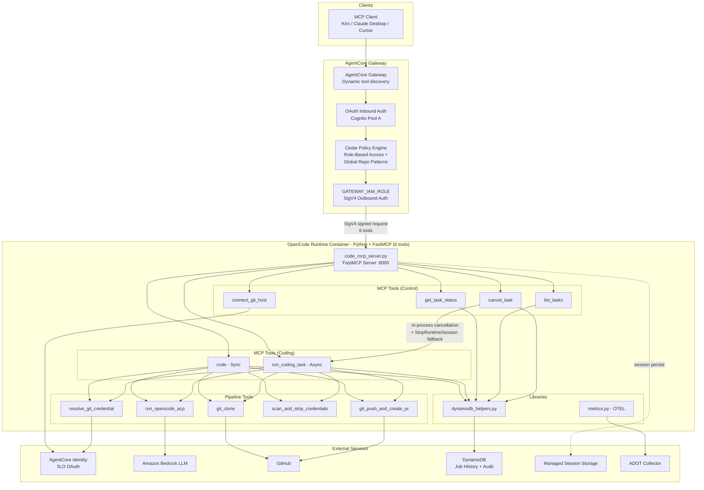

# OpenCode on AgentCore

A Code Factory pattern on AWS: delegate coding tasks from any MCP client to isolated cloud sandboxes that open pull requests, built on Amazon Bedrock AgentCore Runtime, Gateway, Identity, Policy, and Observability.

## Overview

This sample runs [OpenCode](https://opencode.ai), an open-source AI coding agent, as the workload inside an Amazon Bedrock AgentCore Runtime. A single FastMCP server exposes six MCP tools that clone a Git repository, run OpenCode against a task description, scan the result for leaked credentials, push a branch, and open a pull request. Each task runs in an isolated Firecracker microVM; sync and async execution modes are both supported, and the six tools are reachable through any MCP client (Kiro, Claude Desktop, Cursor) by way of an AgentCore Gateway.

The purpose of the sample is to show how AgentCore's building blocks compose into an end-to-end workload. Runtime hosts the MCP server and manages async task lifecycle and session storage. Gateway fronts the Runtime, authenticates callers via Cognito, and authenticates itself to the Runtime over SigV4. Identity vaults the per-user Git OAuth tokens used by the pipeline. Policy evaluates Cedar rules to gate which tools a caller can invoke against which repositories. Observability flows OTEL metrics through the managed ADOT sidecar into the built-in GenAI dashboard. The section below maps each capability to the code that exercises it.

## Why

Engineering leaders want to scale AI-assisted development across the org, platform and IT teams need centralized governance and audit over those workloads, and individual developers want to fire off long-running tasks without blocking their IDE - but there is no standard pattern on AWS for running AI coding agents as a multi-tenant, policy-gated service. OpenCode on AgentCore implements a Code Factory pattern where coding tasks are delegated from any MCP-native client (Kiro, Claude Desktop, Cursor) to isolated cloud sandboxes that clone the target repository, run the OpenCode agent, push a branch, and open a pull request. It serves as a reference architecture for AgentCore Runtime, Gateway, Identity, Policy, and Observability, gives platform teams centralized identity, authorization, and tracing out of the box, and keeps the architecture open so OpenCode can be swapped for another agent and GitHub for another git host.

## AgentCore Capabilities Demonstrated

This sample exercises five AgentCore capabilities and deliberately does not use three others. The table below maps each capability to the code or stack that implements it; the "AgentCore Deep Dives" section further down expands on each used capability.

| AgentCore Capability | How this sample uses it | Reference |
|---|---|---|
| **Runtime** | FastMCP server hosted in a Firecracker microVM. Async tasks via `add_async_task` / `HealthyBusy`; managed session storage; cross-session cancellation via `StopRuntimeSession`. | `container/code_mcp_server.py`, `stacks/agentcore_stack.py` |
| **Gateway** | MCP Server target with dynamic tool discovery. Cognito JWT inbound auth; SigV4 outbound auth via `GATEWAY_IAM_ROLE`; REQUEST interceptor strips the inbound `Authorization` header. | `stacks/gateway_stack.py`, `lambda/interceptor/index.py` |
| **Identity** | 3-legged OAuth credential providers for GitHub. Interactive OAuth consent via MCP elicitation. OAuth callback handled by API Gateway + Lambda. | `stacks/identity_stack.py`, `lambda/oauth_callback/index.py`, `container/tools/resolve_git_credential.py` |
| **Policy** | Cedar policies control tool access per role and by global repo patterns. Action naming `opencode___{tool}`. | `stacks/policy_stack.py`, `scripts/create-policies.py` |
| **Observability** | OTEL metrics via the managed ADOT sidecar; visible in the AgentCore GenAI observability dashboard. | `container/lib/metrics.py`, `stacks/observability_stack.py` |
| **Memory** | Not used. Job history is kept in DynamoDB (audit) and filesystem state in managed session storage; Memory is orthogonal to this workload. | - |
| **Tools (built-in)** | Not used. The workload invokes the OpenCode binary as a subprocess rather than Code Interpreter or Browser Tool. | - |
| **Evaluation** | Not used. Outcome correctness is validated by CI on the produced PR, not by built-in evaluators. | - |

## Architecture



The graph above shows the end-to-end request path: an MCP client calls the AgentCore Gateway, which handles Cognito JWT auth, Cedar policy evaluation, and SigV4-signed forwarding to the FastMCP server inside the Runtime microVM. The six MCP tools share a five-step pipeline (credential resolution, clone, OpenCode run, credential scan, push + PR) and record audit state in DynamoDB. Identity vaults per-user OAuth tokens, and OTEL metrics flow to the managed GenAI observability dashboard.

See [docs/ARCHITECTURE.md](docs/ARCHITECTURE.md) for the full architecture walkthrough, message flow diagrams (sync, async, cancellation), the DynamoDB job-lifecycle state diagram, and the CDK stack structure.

## Prerequisites

- Python 3.12+
- AWS CDK CLI (`npm install -g aws-cdk`)
- Docker with ARM64 support (Apple Silicon, Graviton, or Docker buildx)
- AWS credentials configured with admin access to the target account
- A region that supports [Amazon Bedrock AgentCore](https://aws.amazon.com/bedrock/agentcore/). `us-east-1` and `eu-central-1` are confirmed; other regions may work but are untested. See [docs/HARDENING.md#tested-regions](docs/HARDENING.md#tested-regions) for the full regional matrix.

## Deployment

The deploy takes roughly 15-20 minutes end to end. Runtime creation alone is about 5 minutes, and VPC endpoint provisioning is the next-longest step. Docker must be running so CDK can build the container image.

```bash
# 1. Install dependencies
python -m venv .venv && source .venv/bin/activate
pip install -r requirements.txt

# 2. Configure target account and region (pick one approach):
#    Option A: Set in cdk.json context fields "account" and "region"
#    Option B: Export environment variables:
export AWS_PROFILE=my-profile          # omit if using default credentials
export AWS_REGION=us-east-1
export CDK_DEFAULT_ACCOUNT=123456789012
export CDK_DEFAULT_REGION=$AWS_REGION

# 3. Bootstrap CDK (first time only)
cdk bootstrap aws://$CDK_DEFAULT_ACCOUNT/$CDK_DEFAULT_REGION

# 4. Deploy all stacks
cdk deploy --all --require-approval never
# Or use the deploy script:
# ./scripts/deploy.sh

# 5. Create Cedar policies (managed via API due to CfnPolicy stabilization issues)
python scripts/create-policies.py --region $AWS_REGION
```

IAM role names are region-suffixed (e.g., `opencode-agentcore-execution-role-us-east-1`) so the same account can host deployments in multiple regions side by side.

Known deployment caveats (alpha CDK module, `IamCredentialProvider` workaround, Gateway -> DefaultPolicy ordering, why `create-policies.py` is still a script) are documented in [docs/HARDENING.md#deployment-notes](docs/HARDENING.md#deployment-notes).

### Configuration reference

The following `cdk.json` context values tune the deployment:

| Parameter | Default | Description |
|-----------|---------|-------------|
| `account` | - | AWS account ID (or use `CDK_DEFAULT_ACCOUNT`) |
| `region` | - | AWS region (or use `CDK_DEFAULT_REGION`) |
| `default_model_id` | `global.anthropic.claude-opus-4-6-v1` | Bedrock model ID |
| `daily_cost_budget_usd` | `50` | Reference value for daily Bedrock spend (not enforced - see [AWS Budgets](docs/HARDENING.md#aws-budgets-for-cost-control)) |
| `task_timeout_minutes_default` | `10` | Default task timeout (minutes) |
| `task_timeout_minutes_max` | `30` | Maximum task timeout (minutes) |
| `cloudwatch_log_retention_days` | `90` | CloudWatch log retention |
| `enable_cloudtrail` | `false` | Enable CloudTrail audit logging. Set to `true` for production deployments. |
| `availability_zones` | `[]` | Specific AZs to use (auto-selects 2 if empty) |

### Stack outputs

After deployment, these CloudFormation outputs contain the values you need:

| Stack | Output key | Description |
|-------|------------|-------------|
| `OpenCodeGateway` | `GatewayUrl` | MCP endpoint URL for clients |
| `OpenCodeGateway` | `GatewayId` | Gateway identifier |
| `OpenCodeGateway` | `GatewayArn` | Gateway ARN (used in Cedar resource constraints) |
| `OpenCodePolicy` | `PolicyEngineId` | Cedar Policy Engine ID |
| `OpenCodePolicy` | `PolicyEngineArn` | Cedar Policy Engine ARN |
| `OpenCodeAgentCore` | `RuntimeId` | OpenCode Runtime ID |
| `OpenCodeIdentity` | `WorkloadIdentityArn` | Workload Identity ARN |
| `OpenCodeIdentity` | `WorkloadIdentityName` | Workload Identity name (`opencode_runtime`) |
| `OpenCodeCallbackApi` | `OAuthCallbackUrl` | OAuth callback URL |

Retrieve any output with:

```bash
aws cloudformation describe-stacks --stack-name <StackName> --region <region> \
  --query "Stacks[0].Outputs[?OutputKey=='<Key>'].OutputValue" --output text
```

### Testing

```bash
source .venv/bin/activate

# Unit tests (fast, no AWS credentials needed)
python -m pytest tests/unit/ -v

# Property-based tests (Hypothesis; may take longer)
python -m pytest tests/property/ -v

# Everything
python -m pytest tests/ -v
```

Unit and property tests run offline with mocked dependencies. Integration tests in `tests/integration/` are stubs for future live-environment testing. After deploying, `scripts/smoke-test.py` exercises the Gateway end to end (MCP `initialize`, `tools/list`, and a `tools/call` round-trip on `list_tasks`).

## Usage

After deployment, create a user, register a git provider, and connect your MCP client.

### Create a Cognito user

```bash
USER_POOL_ID=$(aws cloudformation describe-stacks --stack-name OpenCodeSecurity \
  --region $AWS_REGION --query "Stacks[0].Outputs[?OutputKey=='UserPoolId'].OutputValue" --output text)

aws cognito-idp admin-create-user \
  --user-pool-id $USER_POOL_ID \
  --username user@example.com \
  --temporary-password 'TempPass123!@#' \
  --user-attributes Name=email,Value=user@example.com Name=email_verified,Value=true \
  --region $AWS_REGION

aws cognito-idp admin-set-user-password \
  --user-pool-id $USER_POOL_ID \
  --username user@example.com \
  --password 'YourPermanentPass123!@#' \
  --permanent \
  --region $AWS_REGION
```

### Register a GitHub OAuth App

Create an OAuth App at [github.com/settings/developers](https://github.com/settings/developers). For the callback URL, use the value shown by the setup script (it includes a provider-specific UUID assigned by AgentCore Identity). Then run:

```bash
./scripts/setup-oauth-app.sh
```

The script picks up `AWS_REGION` and `AWS_PROFILE` from the environment. It stores the credentials in Secrets Manager and registers the credential provider with AgentCore Identity. Safe to re-run (updates existing credentials).

### Connect an MCP client

Connect Kiro, Claude Desktop, or Cursor to the deployed Gateway using one of three authentication options: an auto-refresh wrapper script (recommended, no token on disk), a hardcoded Cognito ID token (quick setup, expires in 24 hours), or AWS IAM SigV4 (for operators with direct AWS credentials).

See [docs/MCP-CLIENTS.md](docs/MCP-CLIENTS.md) for the full configuration guide, including per-client config file locations and token acquisition steps.

### Smoke test (optional)

```bash
python scripts/smoke-test.py --region $AWS_REGION --profile $AWS_PROFILE \
  --username user@example.com
```

Verifies the runtime is healthy and the six tools are discoverable through the Gateway (MCP `initialize`, `tools/list`, and a `tools/call` round-trip on `list_tasks`).

## AgentCore Deep Dives

Five subsections, one per AgentCore capability this sample uses. Each opens with a one-sentence definition, then describes how the capability shows up in this codebase and points at the file(s) that implement it. For the end-to-end request path, see [docs/ARCHITECTURE.md](docs/ARCHITECTURE.md).

### Runtime

**Definition.** AgentCore Runtime is a managed compute service that hosts agent code inside per-session Firecracker microVMs and provides session lifecycle, async task scheduling, and durable session storage.

This sample ships a single FastMCP server in [`container/code_mcp_server.py`](container/code_mcp_server.py) that exposes six MCP tools over Streamable HTTP on port 8000. The Runtime is declared in [`stacks/agentcore_stack.py`](stacks/agentcore_stack.py), which builds the container image, creates the execution role with Bedrock-invoke and Identity-SDK permissions, and (in regions where the CFN schema accepts it) enables managed session storage via `FilesystemConfigurations` so work directories survive microVM stop/resume.

Long-running coding jobs run through the async task interface. The `run_coding_task` tool calls `add_async_task()`, which registers the job with the Runtime's scheduler and returns a `job_id` immediately; the Runtime surfaces a `HealthyBusy` status to the Gateway while background work progresses, so subsequent requests on the same session know something is already in flight.

The `cancel_task` tool demonstrates cross-session cancellation. In-process cancellation is tried first, but if the job is running on a different session the tool falls back to the Runtime control-plane `StopRuntimeSession` API, which terminates the worker microVM wherever it happens to be, then records the terminal state in DynamoDB.

### Gateway

**Definition.** AgentCore Gateway is a managed MCP front door that authenticates inbound callers, evaluates policy, and forwards MCP calls to one or more registered targets (MCP Server, Lambda, OpenAPI, or Smithy).

The Gateway is declared in [`stacks/gateway_stack.py`](stacks/gateway_stack.py). Inbound auth is a `CustomJwtAuthorizer` bound to a Cognito user pool; outbound auth to the Runtime uses `GATEWAY_IAM_ROLE` so the Gateway signs forwarded requests with SigV4 instead of reusing the caller's JWT. The target is configured as an MCP Server pointing at the Runtime, so the six tools are discovered dynamically at tool-list time rather than being enumerated in the template.

Between inbound JWT validation and outbound SigV4 signing, a REQUEST interceptor Lambda runs ([`lambda/interceptor/index.py`](lambda/interceptor/index.py)). Its job is subtle: the Runtime protocol for Streamable HTTP reserves the `Authorization` header for the Gateway's own SigV4 signature, but inbound MCP requests already carry the caller's Cognito bearer token in that header. If both headers coexist downstream, signature validation fails. The interceptor strips the inbound `Authorization` header, decodes the JWT it carried, and injects the caller's `sub` claim into tool arguments as `_user_id` so tools can still attribute work to a user. The deeper rationale lives in [docs/ARCHITECTURE.md#architectural-decisions](docs/ARCHITECTURE.md#architectural-decisions).

### Identity

**Definition.** AgentCore Identity is a managed workload-identity and credential-vaulting service that brokers 3-legged OAuth flows on behalf of an agent, returning short-lived access tokens without the agent ever touching the refresh token.

This sample registers a GitHub OAuth2 credential provider in [`stacks/identity_stack.py`](stacks/identity_stack.py). A workload identity named `opencode_runtime` binds the Runtime's execution role to this provider so `get_token` calls from inside the microVM are authorized by Identity.

Interactive consent is delivered via the `connect_git_host` MCP tool. When invoked, it calls `ctx.elicit()` to push the provider's authorization URL back to the caller's MCP client, pauses, and resumes once Identity receives the callback. The callback itself is handled by an API Gateway HTTP API fronting [`lambda/oauth_callback/index.py`](lambda/oauth_callback/index.py), which forwards the authorization code to Identity and closes the loop. The async `run_coding_task` pipeline cannot elicit mid-job, so it fails fast with `git_host_not_connected` if credentials for the target host have not been vaulted yet. Token resolution at tool-call time happens in [`container/tools/resolve_git_credential.py`](container/tools/resolve_git_credential.py).

### Policy

**Definition.** AgentCore Policy is a Cedar-based policy engine you can attach to a Gateway to evaluate permit/forbid rules on every MCP tool call, either in LOG_ONLY mode (observability) or ENFORCE mode (blocking).

The Policy Engine is provisioned in [`stacks/policy_stack.py`](stacks/policy_stack.py) and associated with the Gateway in **LOG_ONLY** mode by default. Policies themselves are created post-deploy by [`scripts/create-policies.py`](scripts/create-policies.py) rather than CDK, because the `CfnPolicy` resource handler has a stabilization bug that surfaces as `CREATE_FAILED` even on successful creation.

Action names follow AgentCore's `{target}___{tool}` convention with three underscores. Because this sample registers a single MCP Server target named `opencode`, the effective action identifiers are `opencode___code`, `opencode___run_coding_task`, `opencode___connect_git_host`, `opencode___get_task_status`, `opencode___list_tasks`, and `opencode___cancel_task`.

The bundled policies express two axes of control: role-based access (the `readonly` role is forbidden from `opencode___run_coding_task` and `opencode___cancel_task`) and repo-pattern access (a global `forbid` rule for repositories matching `*-production`). Flipping from LOG_ONLY to ENFORCE and adding organization-specific rules is covered in [docs/HARDENING.md#cedar-policy-engine](docs/HARDENING.md#cedar-policy-engine).

### Observability

**Definition.** AgentCore Observability is the managed telemetry path that collects OTEL traces, metrics, and logs from every Runtime session via a built-in ADOT sidecar and renders them in a managed GenAI observability dashboard.

This sample emits OTEL metrics from inside the microVM using the helpers in [`container/lib/metrics.py`](container/lib/metrics.py). The ADOT collector is provided by the AgentCore platform: no sidecar definition or exporter configuration lives in the CDK tree; [`stacks/observability_stack.py`](stacks/observability_stack.py) only declares CloudWatch log groups for the Runtime and the Gateway's interceptor Lambda.

What shows up in the managed GenAI dashboard without any extra wiring: per-invocation token usage and cost, full request traces across Gateway and Runtime, and per-user traceability (the `_user_id` injected by the interceptor is captured as a span attribute, so every job is attributable to its caller). The sample's custom metrics add job duration and files-edited counts per coding task, which surface alongside the built-in token and latency metrics.

What is **not** set up: custom CloudWatch dashboards, custom alarms, and AWS Budgets for Bedrock spend. The `daily_cost_budget_usd` value in `cdk.json` is a reference only; see the AWS Budgets section in [docs/HARDENING.md](docs/HARDENING.md) for how to wire real cost alerts.

## MCP Tools

Six tools exposed through the AgentCore Gateway via a single MCP Server target named `opencode`. Cold start is roughly 1.2 s per microVM.

| Tool | Mode | Description | Required parameters |
|------|------|-------------|---------------------|
| `code` | Sync | Execute coding task, stream progress via MCP, return PR URL. Uses `ctx.elicit()` for OAuth consent if needed. | `task_description`, `repo_url`, `base_branch` |
| `run_coding_task` | Async | Submit task, get `job_id` immediately. Runs in background via AgentCore async tasks. No mid-task clarification. | `task_description`, `repo_url`, `base_branch` |
| `connect_git_host` | Sync | Connect a git host (GitHub) by completing OAuth via elicitation. Run before submitting coding tasks to a new host. | `git_host` |
| `get_task_status` | Sync | Poll job status by `job_id` from DynamoDB. | `job_id` |
| `list_tasks` | Sync | List jobs for the authenticated user. Supports status filtering, capped at 100 results. | - |
| `cancel_task` | Sync | Cancel a running task. In-process first; falls back to cross-session `StopRuntimeSession`. | `job_id` |

See [docs/TOOLS.md](docs/TOOLS.md) for example inputs and outputs, and the full list of Cedar action identifiers.

## Project Structure

```
├── app.py                          # CDK app entry point
├── cdk.json                        # CDK context configuration
├── stacks/
│   ├── vpc_stack.py                # VPC, NAT, ECR endpoints
│   ├── security_stack.py           # KMS, Cognito Pool A (end-user auth)
│   ├── job_store_stack.py          # DynamoDB (user-partitioned, 4 states)
│   ├── callback_api_stack.py       # OAuth Callback HTTP API + Lambda
│   ├── agentcore_stack.py          # Runtime, ECR, Bedrock IAM, managed session storage
│   ├── gateway_stack.py            # Gateway + MCP Server target (dynamic tool discovery)
│   ├── policy_stack.py             # Cedar Policy Engine (policies created post-deploy)
│   ├── identity_stack.py           # Credential Providers (GitHub)
│   └── observability_stack.py      # CloudWatch log groups
├── scripts/
│   ├── deploy.sh                   # Wrapper: cdk deploy + create-policies
│   ├── create-policies.py          # Post-deploy: create Cedar policies via boto3 API
│   ├── smoke-test.py               # Post-deploy: verify runtime health and tool invocation
│   ├── cleanup-retained-resources.sh  # Remove RETAIN-policy resources after `cdk destroy`
│   ├── get-token.sh                # Helper: acquire Cognito JWT for MCP clients
│   ├── mcp-opencode-client.sh      # Helper: MCP client wrapper with automatic token refresh
│   └── setup-oauth-app.sh          # Helper: register GitHub OAuth App credentials
├── lambda/
│   ├── interceptor/index.py        # Gateway REQUEST interceptor (JWT → _user_id)
│   └── oauth_callback/index.py     # OAuth callback handler (fronted by API Gateway HTTP API)
├── container/
│   ├── code_mcp_server.py          # FastMCP server (port 8000, 6 tools: code, run_coding_task, connect_git_host, get_task_status, list_tasks, cancel_task)
│   ├── Dockerfile                  # Python 3.12-slim, single process
│   ├── requirements.txt            # boto3, fastmcp, bedrock-agentcore, opentelemetry
│   ├── tools/
│   │   ├── resolve_git_credential.py
│   │   ├── git_clone.py
│   │   ├── run_opencode_acp.py
│   │   ├── scan_and_strip_credentials.py
│   │   └── git_push_and_create_pr.py
│   └── lib/
│       ├── dynamodb_helpers.py     # Job history/audit records
│       └── metrics.py              # OTEL metric helpers
└── tests/
    ├── property/                   # Hypothesis property-based tests
    ├── integration/                # Integration tests
    └── unit/                       # Unit tests
```

## Status and Limitations

This sample is meant to illustrate how AgentCore's building blocks compose into a realistic workload. It is not a production-ready product - defaults optimize for cost and clarity. For production use, start with [docs/HARDENING.md](docs/HARDENING.md).

- **Memory, built-in Tools (Code Interpreter / Browser Tool), and Evaluation capabilities are deliberately not used.** See the capability mapping table above for the rationale.
- **No task-level retries or dead-letter queues.** Failed pipeline steps fail the job immediately. The only exception is `git push`, which has a 3-retry rebase loop for concurrent-push races.
- **Async tasks cannot elicit.** The `run_coding_task` async path cannot pause for OAuth consent mid-job, so users must run `connect_git_host` first. A missing credential surfaces as `git_host_not_connected`.
- **Regional availability.** `us-east-1` and `eu-central-1` are tested. Other AgentCore-supported regions may work but are untested. Managed session storage (`FilesystemConfigurations`) only activates in regions where the CFN schema accepts it. See [docs/HARDENING.md#tested-regions](docs/HARDENING.md#tested-regions).
- **Outbound traffic is not FQDN-restricted.** Git clone and push to any HTTPS host on the public internet are unfiltered via the NAT Gateway. See [docs/HARDENING.md#known-limitations](docs/HARDENING.md#known-limitations).
- **GSI1 admin-monitoring index has a partition cap.** The `status#{status}` GSI has only 4 partition-key values, so at high volume it hits per-partition RCU/WCU limits. See [docs/HARDENING.md#known-limitations](docs/HARDENING.md#known-limitations).
- **Alpha CDK module.** The Gateway stack depends on `aws_cdk.aws_bedrock_agentcore_alpha`. Alpha APIs may break between minor CDK versions; the requirement is pinned with a tight upper bound to catch drift.
- **`CfnPolicy` is managed via a post-deploy script**, not native CDK, because the resource handler reports `NotStabilized` even on successful creation. See [`scripts/create-policies.py`](scripts/create-policies.py).

## Cleanup

Several resources (DynamoDB table, S3 bucket, ECR repository, CloudWatch log groups) use a `RETAIN` removal policy so a `cdk destroy` does not silently drop data. The tradeoff is that these resources survive the destroy and can cause "already exists" errors on the next deploy unless you clean them up.

```bash
cdk destroy --all
./scripts/cleanup-retained-resources.sh
```

The cleanup script removes the `opencode-jobs` table, the `opencode-artifacts-*` bucket, the `opencode-agentcore` ECR repository, the `/opencode/*` log groups, and any orphaned networking resources tagged `Project=OpenCode`. AgentCore-managed ENIs can take 5-10 minutes to release after runtime deletion - re-run the script if it reports ENIs still releasing.

If deployment fails or `cdk destroy` leaves resources behind, see [docs/TROUBLESHOOTING.md](docs/TROUBLESHOOTING.md).

## Cost considerations

Base infrastructure cost, with no tasks running, is roughly:

- VPC interface endpoints: ~$161/month (11 endpoints × 2 AZs at $0.01/endpoint/AZ/hour)
- NAT Gateway: ~$32/month plus data transfer
- KMS CMK: ~$1/month
- DynamoDB, S3, CloudWatch: pay-per-use, negligible at low volume
- AgentCore Runtimes: scale to zero when idle

Per-task cost is dominated by Bedrock token usage and Firecracker compute time. To wire actual cost alerts, see [docs/HARDENING.md#aws-budgets-for-cost-control](docs/HARDENING.md#aws-budgets-for-cost-control).

## Security

> **This is sample code for non-production usage.** You should work with your security and legal teams to meet your organizational security, regulatory, and compliance requirements before deployment. Deploying this sample creates AWS resources that may incur charges; review the cost section above.

**You are responsible** for validating this sample against your own security, compliance, and regulatory requirements before deployment. The defaults optimize for cost and clarity in a demo deployment and are not intended to pass a production-grade review as-is.

### Shared responsibility in this sample

The sample uses several AWS services, each of which is governed by the [AWS Shared Responsibility Model](https://aws.amazon.com/compliance/shared-responsibility-model/). The table below summarizes which concerns AWS manages for you and which you are expected to manage yourself when adopting this sample.

| Concern | AWS manages | You manage |
|---------|-------------|------------|
| Underlying Amazon Bedrock AgentCore control plane and data plane | ✅ | |
| AgentCore Identity Vault (OAuth token storage at rest) | ✅ | |
| Amazon Bedrock model hosting, runtime isolation, and upstream model safety filters | ✅ | |
| AWS KMS CMK lifecycle (rotation is enabled, but you own the key policy) | partial | ✅ |
| Amazon Cognito user pool lifecycle (create, disable, MFA policy, password reset) | | ✅ |
| Cedar policy content, scope, and switching from `LOG_ONLY` to `ENFORCE` | | ✅ |
| IAM role policies used by the stacks (review, scope, add conditions) | | ✅ |
| Reviewing AWS CloudTrail logs and GenAI observability dashboards for anomalies | | ✅ |
| Upstream OpenCode binary integrity and version pinning (installed at container build time) | | ✅ |
| GitHub OAuth App registration, scopes, and credential rotation | | ✅ |
| VPC egress filtering (NAT allows all outbound port 443 by default) | | ✅ |
| AWS Budgets, alarms, and cost controls | | ✅ |

See [docs/HARDENING.md](docs/HARDENING.md) for production hardening steps (NAT Gateway HA, Cedar enforce mode, AWS Budgets, and known limitations) and [docs/THREAT-MODEL.md](docs/THREAT-MODEL.md) for the STRIDE analysis, trust boundaries, and residual risks.

## License

This project is licensed under the MIT-0 License. See the [LICENSE](LICENSE) file.

## Related Links

- [Amazon Bedrock AgentCore documentation](https://docs.aws.amazon.com/bedrock-agentcore/)
- [Other AgentCore Samples](https://github.com/awslabs/amazon-bedrock-agentcore-samples)
- [OpenCode](https://opencode.ai)
- [Model Context Protocol](https://modelcontextprotocol.io)

