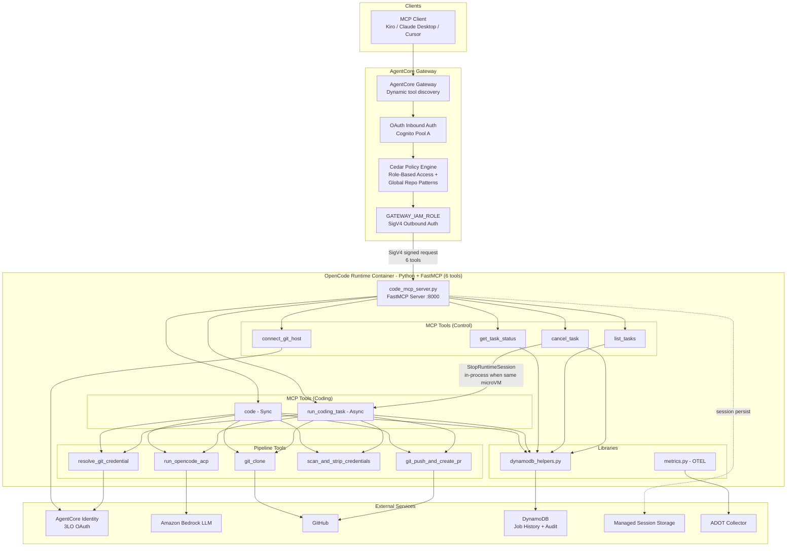

# OpenCode on AgentCore

A Code Factory pattern on AWS: delegate coding tasks from any MCP client to isolated cloud sandboxes that open pull requests, built on Amazon Bedrock AgentCore Runtime, Gateway, Identity, Policy, and Observability.

## Overview

This sample runs [OpenCode](https://opencode.ai), an open-source AI coding agent, as the workload inside an Amazon Bedrock AgentCore Runtime. A single FastMCP server exposes six MCP tools that clone a Git repository, run OpenCode against a task description, scan the result for leaked credentials, push a branch, and open a pull request. Each task runs in an isolated Firecracker microVM; sync and async execution modes are both supported, and the six tools are reachable through any MCP client (Kiro, Claude Desktop, Cursor) by way of an AgentCore Gateway.

The purpose of the sample is to show how AgentCore's building blocks compose into an end-to-end workload. Runtime hosts the MCP server and manages async task lifecycle and session storage. Gateway fronts the Runtime, authenticates callers via Cognito, and authenticates itself to the Runtime over SigV4. Identity vaults the per-user Git OAuth tokens used by the pipeline. Policy evaluates Cedar rules to gate which tools a caller can invoke against which repositories. Observability flows OTEL metrics through the managed ADOT sidecar into the built-in GenAI dashboard. The section below maps each capability to the code that exercises it.

## Why

Engineering leaders want to scale AI-assisted development across the org, platform and IT teams need centralized governance and audit over those workloads, and individual developers want to fire off long-running tasks without blocking their IDE - but there is no standard pattern on AWS for running AI coding agents as a multi-tenant, policy-gated service. OpenCode on AgentCore implements a Code Factory pattern where coding tasks are delegated from any MCP-native client (Kiro, Claude Desktop, Cursor) to isolated cloud sandboxes that clone the target repository, run the OpenCode agent, push a branch, and open a pull request. It serves as a reference architecture for AgentCore Runtime, Gateway, Identity, Policy, and Observability, gives platform teams centralized identity, authorization, and tracing out of the box, and keeps the architecture open so OpenCode can be swapped for another agent and GitHub for another git host.

## AgentCore Capabilities Demonstrated

This sample exercises five AgentCore capabilities and deliberately does not use three others. The table below maps each capability to the code or stack that implements it; the "AgentCore Deep Dives" section further down expands on each used capability.

| AgentCore Capability | How this sample uses it | Reference |
|---|---|---|
| **Runtime** | FastMCP server hosted in a Firecracker microVM. Async tasks via `add_async_task` / `HealthyBusy`; managed session storage mount (Preview, `us-east-1` by default); cross-session cancellation via `StopRuntimeSession`. | `container/code_mcp_server.py`, `stacks/agentcore_stack.py` |
| **Gateway** | MCP Server target with dynamic tool discovery. Cognito JWT inbound auth; SigV4 outbound auth via `GATEWAY_IAM_ROLE`; REQUEST interceptor strips the inbound `Authorization` header; response streaming enabled so `notifications/progress` reach the client. | `stacks/gateway_stack.py`, `lambda/interceptor/index.py` |
| **Identity** | Workload identity `opencode_runtime` plus a 3-legged OAuth credential provider for GitHub (registered post-deploy by `scripts/setup-oauth-app.sh`). Interactive OAuth consent via MCP elicitation. OAuth callback handled by API Gateway + Lambda. | `stacks/callback_api_stack.py`, `scripts/setup-oauth-app.sh`, `lambda/oauth_callback/index.py`, `container/tools/resolve_git_credential.py` |
| **Policy** | Cedar Policy Engine attached to the Gateway. Policies: role-gated permits (`admin` / `developer` on the six tools, `readonly` on the two status tools), readonly forbids on `code` / `run_coding_task` / `cancel_task`, and a production-repo forbid. LOG_ONLY by default. Action naming `opencode___{tool}`. | `stacks/gateway_stack.py`, `scripts/create-policies.py` |
| **Observability** | OTEL metrics via the managed ADOT sidecar; visible in the AgentCore GenAI observability dashboard. No observability resources in the CDK tree beyond the log groups each stack creates for its own Lambdas. | `container/lib/metrics.py` |
| **Memory** | Not used. Job history is kept in DynamoDB (audit) and filesystem state in the Runtime microVM; Memory is orthogonal to this workload. | - |
| **Tools (built-in)** | Not used. The pipeline runs the Bun-compiled OpenCode binary, a git checkout, and an authenticated push as one subprocess workflow inside the Runtime microVM; moving that into Code Interpreter would be impractical for this workload. | - |
| **Evaluation** | Not used. Outcome correctness is validated by CI on the produced PR, not by built-in evaluators. | - |

## Architecture


```mermaid
graph TB
    subgraph Clients
        MCP[MCP Client<br/>Kiro / Claude Desktop / Cursor]
    end

    subgraph "AgentCore Gateway"
        GW[AgentCore Gateway<br/>Dynamic tool discovery]
        GW_AUTH[OAuth Inbound Auth<br/>Cognito Pool A]
        CEDAR[Cedar Policy Engine<br/>Role-Based Access +<br/>Global Repo Patterns]
        GW_ROLE[GATEWAY_IAM_ROLE<br/>SigV4 Outbound Auth]
    end

    subgraph "OpenCode Runtime Container - Python + FastMCP (6 tools)"
        FASTMCP[code_mcp_server.py<br/>FastMCP Server :8000]

        subgraph "MCP Tools (Coding)"
            T_CODE[code - Sync]
            T_ASYNC[run_coding_task - Async]
        end

        subgraph "MCP Tools (Control)"
            T_CGH[connect_git_host]
            T_STATUS[get_task_status]
            T_LIST[list_tasks]
            T_CANCEL[cancel_task]
        end

        subgraph "Pipeline Tools"
            T_CRED[resolve_git_credential]
            T_CLONE[git_clone]
            T_OPENCODE[run_opencode_acp]
            T_SCAN[scan_and_strip_credentials]
            T_PUSH[git_push_and_create_pr]
        end

        subgraph "Libraries"
            LIB_DDB[dynamodb_helpers.py]
            LIB_METRICS[metrics.py - OTEL]
        end

        FASTMCP --> T_CODE
        FASTMCP --> T_ASYNC
        FASTMCP --> T_CGH
        FASTMCP --> T_STATUS
        FASTMCP --> T_LIST
        FASTMCP --> T_CANCEL
        T_CODE --> T_CRED
        T_CODE --> T_CLONE
        T_CODE --> T_OPENCODE
        T_CODE --> T_SCAN
        T_CODE --> T_PUSH
        T_ASYNC --> T_CRED
        T_ASYNC --> T_CLONE
        T_ASYNC --> T_OPENCODE
        T_ASYNC --> T_SCAN
        T_ASYNC --> T_PUSH
        T_CODE --> LIB_DDB
        T_ASYNC --> LIB_DDB
        T_STATUS --> LIB_DDB
        T_LIST --> LIB_DDB
        T_CANCEL --> LIB_DDB
        T_CANCEL -->|StopRuntimeSession<br/>in-process when same microVM| T_ASYNC
    end

    subgraph "External Services"
        IDENTITY[AgentCore Identity<br/>3LO OAuth]
        BEDROCK[Amazon Bedrock LLM]
        GITHUB[GitHub]
        DDB[DynamoDB<br/>Job History + Audit]
        SESSION[Managed Session Storage]
        OTEL[ADOT Collector]
    end

    %% Top-to-bottom flow: Clients -> Gateway -> Runtime -> External Services
    MCP --> GW
    GW --> GW_AUTH
    GW_AUTH --> CEDAR
    CEDAR --> GW_ROLE
    GW_ROLE -->|SigV4 signed request<br/>6 tools| FASTMCP

    %% Runtime -> External Services (these edges pull External Services below)
    T_CGH --> IDENTITY
    T_CRED --> IDENTITY
    T_OPENCODE --> BEDROCK
    T_CLONE --> GITHUB
    T_PUSH --> GITHUB
    LIB_DDB --> DDB
    LIB_METRICS --> OTEL
    FASTMCP -.->|session persist| SESSION
```

The graph above shows the end-to-end request path: an MCP client calls the AgentCore Gateway, which handles Cognito JWT auth, Cedar policy evaluation, and SigV4-signed forwarding to the FastMCP server inside the Runtime microVM. The six MCP tools share a five-step pipeline (credential resolution, clone, OpenCode run, credential scan, push + PR) and record audit state in DynamoDB. Identity vaults per-user OAuth tokens, and OTEL metrics flow to the managed GenAI observability dashboard.

See [docs/ARCHITECTURE.md](docs/ARCHITECTURE.md) for the full architecture walkthrough, message flow diagrams (sync, async, cancellation), the DynamoDB job-lifecycle state diagram, and the CDK stack structure.

## Prerequisites

- Python 3.12+
- AWS CDK CLI (`npm install -g aws-cdk`)
- Docker with ARM64 support (Apple Silicon, Graviton, or Docker buildx)
- AWS credentials configured with admin access to the target account
- A region that supports [Amazon Bedrock AgentCore](https://aws.amazon.com/bedrock/agentcore/). `us-east-1` and `eu-central-1` are confirmed; other regions may work but are untested. See [docs/HARDENING.md#tested-regions](docs/HARDENING.md#tested-regions) for the full regional matrix.

## Deployment

The deploy takes roughly 15-20 minutes end to end. Runtime creation alone is about 5 minutes, and VPC endpoint provisioning is the next-longest step. Docker must be running so CDK can build the container image.

```bash
# 1. Install dependencies
python -m venv .venv && source .venv/bin/activate
pip install -r requirements.txt

# 2. Configure target account and region (pick one approach):
#    Option A: Set in cdk.json context fields "account" and "region"
#    Option B: Export environment variables:
export AWS_PROFILE=my-profile          # omit if using default credentials
export AWS_REGION=us-east-1
export CDK_DEFAULT_ACCOUNT=123456789012
export CDK_DEFAULT_REGION=$AWS_REGION

# 3. Bootstrap CDK (first time only)
cdk bootstrap aws://$CDK_DEFAULT_ACCOUNT/$CDK_DEFAULT_REGION

# 4. Deploy all stacks
cdk deploy --all --require-approval never
# Or use the deploy script:
# ./scripts/deploy.sh

# 5. Create Cedar policies (managed via API due to CfnPolicy stabilization issues)
python scripts/create-policies.py --region $AWS_REGION
```

IAM role names are region-suffixed (e.g., `opencode-agentcore-execution-role-us-east-1`) so the same account can host deployments in multiple regions side by side.

Known deployment caveats (alpha CDK module, `IamCredentialProvider` workaround, Gateway -> DefaultPolicy ordering, why `create-policies.py` is still a script) are documented in [docs/HARDENING.md#deployment-notes](docs/HARDENING.md#deployment-notes).

### Configuration reference

The following `cdk.json` context values tune the deployment:

| Parameter | Default | Description |
|-----------|---------|-------------|
| `account` | - | AWS account ID (or use `CDK_DEFAULT_ACCOUNT`) |
| `region` | - | AWS region (or use `CDK_DEFAULT_REGION`) |
| `default_model_id` | `global.anthropic.claude-opus-4-6-v1` | Bedrock model ID |
| `daily_cost_budget_usd` | `50` | Reference value for daily Bedrock spend (not enforced - see [AWS Budgets](docs/HARDENING.md#aws-budgets-for-cost-control)) |
| `task_timeout_minutes_default` | `10` | Default task timeout (minutes) |
| `task_timeout_minutes_max` | `30` | Maximum task timeout (minutes) |
| `cloudwatch_log_retention_days` | `90` | CloudWatch log retention |
| `enable_cloudtrail` | `false` | Enable CloudTrail audit logging. Set to `true` for production deployments. |
| `availability_zones` | `[]` | Specific AZs to use (auto-selects 2 if empty) |
| `gateway_exception_level` | unset (off) | `DEBUG` surfaces detailed Gateway errors to callers. Use only while debugging. |
| `enable_filesystem_configurations` | unset (on only in `us-east-1`) | `true` / `false` forces the managed session storage mount on or off |

### Stack outputs

After deployment, these CloudFormation outputs contain the values you need:

| Stack | Output key | Description |
|-------|------------|-------------|
| `OpenCodeGateway` | `GatewayUrl` | MCP endpoint URL for clients |
| `OpenCodeGateway` | `GatewayId` | Gateway identifier |
| `OpenCodeGateway` | `GatewayArn` | Gateway ARN (used in Cedar resource constraints) |
| `OpenCodeGateway` | `PolicyEngineId` | Cedar Policy Engine ID |
| `OpenCodeGateway` | `PolicyEngineArn` | Cedar Policy Engine ARN |
| `OpenCodeAgentCore` | `RuntimeId` | OpenCode Runtime ID |
| `OpenCodeAgentCore` | `RuntimeEndpointId` | OpenCode Runtime Endpoint ID |
| `OpenCodeCallbackApi` | `OAuthCallbackUrl` | OAuth callback URL |
| `OpenCodeCallbackApi` | `WorkloadIdentityArn` | Workload Identity ARN |
| `OpenCodeCallbackApi` | `WorkloadIdentityName` | Workload Identity name (`opencode_runtime`) |
| `OpenCodeSecurity` | `UserPoolId` | Cognito User Pool ID |
| `OpenCodeSecurity` | `UserPoolClientId` | Cognito app client ID |

Retrieve any output with:

```bash
aws cloudformation describe-stacks --stack-name <StackName> --region <region> \
  --query "Stacks[0].Outputs[?OutputKey=='<Key>'].OutputValue" --output text
```

### Testing

```bash
source .venv/bin/activate

# Unit tests (fast, no AWS credentials needed)
python -m pytest tests/unit/ -v

# Property-based tests (Hypothesis; may take longer)
python -m pytest tests/property/ -v

# Everything
python -m pytest tests/ -v
```

Unit and property tests run offline with mocked dependencies. `cedarpy` (from `requirements.txt`) lets `tests/property/test_cedar_role_enforcement.py` evaluate the real policy statements from `scripts/create-policies.py`. Integration tests in `tests/integration/` are stubs for future live-environment testing. After deploying, `scripts/smoke-test.py` exercises the Gateway end to end (MCP `initialize`, `tools/list`, and a `tools/call` round-trip on `list_tasks`); it sets `custom:role=developer` on a test user that has no role (see [Smoke test](#smoke-test-optional)).

## Usage

After deployment, create a user, register a git provider, and connect your MCP client.

### Create a Cognito user

```bash
USER_POOL_ID=$(aws cloudformation describe-stacks --stack-name OpenCodeSecurity \
  --region $AWS_REGION --query "Stacks[0].Outputs[?OutputKey=='UserPoolId'].OutputValue" --output text)

aws cognito-idp admin-create-user \
  --user-pool-id $USER_POOL_ID \
  --username user@example.com \
  --temporary-password 'TempPass123!@#' \
  --user-attributes Name=email,Value=user@example.com Name=email_verified,Value=true \
  --region $AWS_REGION

aws cognito-idp admin-set-user-password \
  --user-pool-id $USER_POOL_ID \
  --username user@example.com \
  --password 'YourPermanentPass123!@#' \
  --permanent \
  --region $AWS_REGION
```

Assign a role (`readonly`, `developer`, or `admin`). Every user needs one before Cedar is switched to ENFORCE:

```bash
aws cognito-idp admin-update-user-attributes \
  --user-pool-id $USER_POOL_ID \
  --username user@example.com \
  --user-attributes Name=custom:role,Value=readonly \
  --region $AWS_REGION
```

`developer` and `admin` can call all six tools, subject to the production-repo forbid. `readonly` can call only `get_task_status` and `list_tasks`. Under ENFORCE, a user with no role or an unrecognised role is denied every tool; in LOG_ONLY (the default) those calls are logged as DENY but still go through. The `custom:role` attribute is the only role mechanism: the app client can read it but not write it, so roles are set only through Cognito admin APIs, and there are no Cognito groups.

### Register a GitHub OAuth App

Create an OAuth App at [github.com/settings/developers](https://github.com/settings/developers). For the callback URL, use the value shown by the setup script (it includes a provider-specific UUID assigned by AgentCore Identity). Then run:

```bash
./scripts/setup-oauth-app.sh
```

The script picks up `AWS_REGION` and `AWS_PROFILE` from the environment. It stores the credentials in Secrets Manager and registers the credential provider with AgentCore Identity. Safe to re-run (updates existing credentials).

### Connect an MCP client

Connect Kiro, Claude Desktop, or Cursor to the deployed Gateway using one of three authentication options: an auto-refresh wrapper script (recommended, no token on disk), a hardcoded Cognito ID token (quick setup, expires in 24 hours), or AWS IAM SigV4 (for operators with direct AWS credentials).

See [docs/MCP-CLIENTS.md](docs/MCP-CLIENTS.md) for the full configuration guide, including per-client config file locations and token acquisition steps.

### Smoke test (optional)

```bash
python scripts/smoke-test.py --region $AWS_REGION --profile $AWS_PROFILE \
  --username user@example.com
```

Verifies the runtime is healthy and the six tools are discoverable through the Gateway (MCP `initialize`, `tools/list`, and a `tools/call` round-trip on `list_tasks`). If the test user has no `custom:role`, the script sets it to `developer` so the checks pass under ENFORCE; an existing role is left unchanged.

## AgentCore Deep Dives

Five subsections, one per AgentCore capability this sample uses. Each opens with a one-sentence definition, then describes how the capability shows up in this codebase and points at the file(s) that implement it. For the end-to-end request path, see [docs/ARCHITECTURE.md](docs/ARCHITECTURE.md).

### Runtime

**Definition.** AgentCore Runtime is a managed compute service that hosts agent code inside per-session Firecracker microVMs and provides session lifecycle, async task scheduling, and durable session storage.

This sample ships a single FastMCP server in [`container/code_mcp_server.py`](container/code_mcp_server.py) that exposes six MCP tools over Streamable HTTP on port 8000. The Runtime is declared in [`stacks/agentcore_stack.py`](stacks/agentcore_stack.py), which builds the container image, creates the execution role with Bedrock-invoke and Identity-SDK permissions, and enables managed session storage (Preview) via `FilesystemConfigurations` at `/mnt/session` in `us-east-1` by default (override with `enable_filesystem_configurations`). Work directories currently default to `/tmp/opencode-sessions`, not the mount; see [docs/ARCHITECTURE.md#managed-session-storage](docs/ARCHITECTURE.md#managed-session-storage).

Long-running coding jobs run through the async task interface. The `run_coding_task` tool calls `add_async_task()`, which registers the job with the Runtime's scheduler and returns a task handle; the tool returns a `job_id` to the client immediately and the background pipeline passes the handle to `complete_async_task()` when it finishes. While the handle is open the Runtime reports `HealthyBusy` on `/ping`, so the platform knows background work is in flight and does not recycle the microVM.

The `cancel_task` tool demonstrates cross-session cancellation. At submission time the Runtime learns its own session id from the inbound `baggage` header (`session.id=...`) and persists it as `runtime_session_id` on the job record. `cancel_task` reads that record and calls the Runtime control-plane `StopRuntimeSession` API with it, which terminates the worker microVM wherever it happens to be; the job is stopped in-process only when it happens to run on the same microVM as the cancel call, which through the Gateway (one new session per `tools/call`) is effectively never. Terminal DynamoDB writes are conditional on the record still being `RUNNING`, so a late `COMPLETE` from the dying worker cannot overwrite `CANCELLED`, and the pipeline re-reads the record before pushing. When nothing could be stopped, `cancel_task` returns `cancel_failed` and leaves the record untouched instead of claiming success.

### Gateway

**Definition.** AgentCore Gateway is a managed MCP front door that authenticates inbound callers, evaluates policy, and forwards MCP calls to one or more registered targets (MCP Server, Lambda, OpenAPI, or Smithy).

The Gateway is declared in [`stacks/gateway_stack.py`](stacks/gateway_stack.py). Inbound auth is a `CustomJwtAuthorizer` bound to a Cognito user pool; outbound auth to the Runtime uses `GATEWAY_IAM_ROLE` so the Gateway signs forwarded requests with SigV4 instead of reusing the caller's JWT. The target is configured as an MCP Server pointing at the Runtime, so the six tools are discovered dynamically at tool-list time rather than being enumerated in the template. MCP response streaming (`EnableResponseStreaming`) is turned on so the Gateway relays the sync `code` tool's `notifications/progress` events to the client as SSE instead of collapsing the call into one JSON body; the client still has to send `Accept: text/event-stream` and a `_meta.progressToken` to receive them.

Between inbound JWT validation and outbound SigV4 signing, a REQUEST interceptor Lambda runs ([`lambda/interceptor/index.py`](lambda/interceptor/index.py)). Its job is subtle: the Runtime protocol for Streamable HTTP reserves the `Authorization` header for the Gateway's own SigV4 signature, but inbound MCP requests already carry the caller's Cognito bearer token in that header. If both headers coexist downstream, signature validation fails. The interceptor strips the inbound `Authorization` header, decodes the JWT it carried, and injects the caller's `sub` claim into tool arguments as `_user_id` so tools can still attribute work to a user. Any client-supplied `_user_id` is discarded, and a `tools/call` without a derivable identity is rejected. The deeper rationale lives in [docs/ARCHITECTURE.md#architectural-decisions](docs/ARCHITECTURE.md#architectural-decisions).

### Identity

**Definition.** AgentCore Identity is a managed workload-identity and credential-vaulting service that brokers 3-legged OAuth flows on behalf of an agent, returning short-lived access tokens without the agent ever touching the refresh token.

[`stacks/callback_api_stack.py`](stacks/callback_api_stack.py) declares a workload identity named `opencode_runtime` whose allowed OAuth2 return URL is the callback API it also owns. The GitHub OAuth2 credential provider itself is registered post-deploy by [`scripts/setup-oauth-app.sh`](scripts/setup-oauth-app.sh), which stores the OAuth App client ID and secret in Secrets Manager and creates or updates the `github-provider` credential provider in AgentCore Identity. The Runtime's execution role carries the Identity SDK permissions, so `get_token` calls from inside the microVM are authorized by Identity.

Interactive consent is delivered via the `connect_git_host` MCP tool. When invoked, it calls `ctx.elicit()` to push the provider's authorization URL back to the caller's MCP client, pauses, and resumes once Identity receives the callback. The callback itself is handled by an API Gateway HTTP API fronting [`lambda/oauth_callback/index.py`](lambda/oauth_callback/index.py), which forwards the authorization code to Identity and closes the loop. The async `run_coding_task` pipeline cannot elicit mid-job, so it fails fast with `git_host_not_connected` if credentials for the target host have not been vaulted yet. Token resolution at tool-call time happens in [`container/tools/resolve_git_credential.py`](container/tools/resolve_git_credential.py).

### Policy

**Definition.** AgentCore Policy is a Cedar-based policy engine you can attach to a Gateway to evaluate permit/forbid rules on every MCP tool call, either in LOG_ONLY mode (observability) or ENFORCE mode (blocking).

The Policy Engine is provisioned alongside the Gateway in [`stacks/gateway_stack.py`](stacks/gateway_stack.py) and associated with it in **LOG_ONLY** mode by default. Policies themselves are created post-deploy by [`scripts/create-policies.py`](scripts/create-policies.py) rather than CDK, because the `CfnPolicy` resource handler has a stabilization bug that surfaces as `CREATE_FAILED` even on successful creation.

Action names follow AgentCore's `{target}___{tool}` convention with three underscores. Because this sample registers a single MCP Server target named `opencode`, the effective action identifiers are `opencode___code`, `opencode___run_coding_task`, `opencode___connect_git_host`, `opencode___get_task_status`, `opencode___list_tasks`, and `opencode___cancel_task`.

The script creates six policies, four forbids then two role-gated permits:

- `opencode_readonly_deny_coding`, `opencode_readonly_deny_cancel`, `opencode_readonly_deny_code` - forbid `run_coding_task`, `cancel_task`, and `code` for the `readonly` role (defence in depth; readonly has no permit for them either).
- `opencode_deny_production_repos` - forbid `code` and `run_coding_task` when `repo_url` matches `*-production`, `*-production.git`, or `*-production/`. The match is case-sensitive on the raw submitted string, so treat it as a guardrail rather than an access boundary.
- `opencode_permit_full_access` - permit `admin` and `developer` on the six tools.
- `opencode_permit_readonly_status` - permit `readonly` on `get_task_status` and `list_tasks`.

Cedar is default-deny and forbid wins, so under ENFORCE a caller needs a recognised role to call anything, and readonly cannot call `connect_git_host`. The role is read from the principal tag `custom:role`, which the Gateway populates from the `custom:role` claim in the Cognito ID token; there are no Cognito groups. Re-running the script is safe: it creates missing policies, updates changed statements in place, skips identical ones, and deletes only policies in a FAILED state. Confirm the role-gated ALLOW decisions in LOG_ONLY before switching to ENFORCE. That check, flipping the mode, and adding organization-specific rules are covered in [docs/HARDENING.md#cedar-policy-engine](docs/HARDENING.md#cedar-policy-engine).

### Observability

**Definition.** AgentCore Observability is the managed telemetry path that collects OTEL traces, metrics, and logs from every Runtime session via a built-in ADOT sidecar and renders them in a managed GenAI observability dashboard.

This sample emits OTEL metrics from inside the microVM using the helpers in [`container/lib/metrics.py`](container/lib/metrics.py). The ADOT collector and the GenAI dashboard are provided by the AgentCore platform: no sidecar definition, exporter configuration, or observability stack lives in the CDK tree. The only log groups the stacks create are for the Lambdas they own (the Gateway's interceptor in `OpenCodeGateway`, the OAuth callback and authorizer in `OpenCodeCallbackApi`) plus VPC flow logs; Runtime logs go to the AgentCore-managed `/aws/bedrock-agentcore/runtimes/*` log groups.

What shows up in the managed GenAI dashboard without any extra wiring: per-invocation token usage and cost, and full request traces across Gateway and Runtime. The sample does not add span attributes itself; per-user attribution comes from the DynamoDB job record, keyed by `user#{user_id}`. The sample's custom metrics add success/failure/cancelled counts and job duration per coding task, which surface alongside the built-in token and latency metrics; files edited is recorded in the DynamoDB job record.

What is **not** set up: custom CloudWatch dashboards, custom alarms, and AWS Budgets for Bedrock spend. The `daily_cost_budget_usd` value in `cdk.json` is a reference only; see the AWS Budgets section in [docs/HARDENING.md](docs/HARDENING.md) for how to wire real cost alerts.

## MCP Tools

Six tools exposed through the AgentCore Gateway via a single MCP Server target named `opencode`. Cold start is roughly 1.2 s per microVM.

| Tool | Mode | Description | Required parameters |
|------|------|-------------|---------------------|
| `code` | Sync | Execute coding task, relay progress notifications (1/5..5/5) to the client, return PR URL. Uses `ctx.elicit()` for OAuth consent if needed. | `task_description`, `repo_url`, `base_branch` |
| `run_coding_task` | Async | Submit task, get `job_id` immediately. Runs in background via AgentCore async tasks. No mid-task clarification. | `task_description`, `repo_url`, `base_branch` |
| `connect_git_host` | Sync | Connect a git host (GitHub) by completing OAuth via elicitation. Run before submitting coding tasks to a new host. | `git_host` |
| `get_task_status` | Sync | Return the 13-field job record for a `job_id`. | `job_id` |
| `list_tasks` | Sync | List the caller's jobs (same record shape as `get_task_status`). Supports status filtering, capped at 100 results. | - |
| `cancel_task` | Sync | Cross-session via `StopRuntimeSession`; reports `cancel_failed` honestly when nothing could be stopped. | `job_id` |

Both coding tools always commit the working tree and open a PR regardless of task wording; `base_branch` must exist on the remote; `files_edited` paths are relative to the repo root. Progress notifications from `code` require the client to send a `_meta.progressToken` (see [docs/TOOLS.md](docs/TOOLS.md#progress-notifications-code)).

See [docs/TOOLS.md](docs/TOOLS.md) for example inputs and outputs, and the full list of Cedar action identifiers.

## Project Structure

```
├── app.py                          # CDK app entry point
├── cdk.json                        # CDK context configuration
├── stacks/
│   ├── vpc_stack.py                # VPC, NAT, VPC endpoints, flow logs
│   ├── security_stack.py           # KMS CMK, Cognito User Pool (custom:role attribute), optional CloudTrail
│   ├── job_store_stack.py          # DynamoDB (user-partitioned, 4 states)
│   ├── callback_api_stack.py       # OAuth Callback HTTP API + Lambda, workload identity
│   ├── agentcore_stack.py          # Runtime, execution role, Docker image asset, managed session storage
│   └── gateway_stack.py            # Gateway + MCP Server target, REQUEST interceptor, Cedar Policy Engine
├── scripts/
│   ├── deploy.sh                   # Wrapper: cdk deploy + create-policies
│   ├── create-policies.py          # Post-deploy: create Cedar policies via boto3 API
│   ├── smoke-test.py               # Post-deploy: verify runtime health and tool invocation
│   ├── cleanup-retained-resources.sh  # Remove the retained job table and orphaned networking after `cdk destroy`
│   ├── get-token.sh                # Helper: acquire Cognito JWT for MCP clients
│   ├── mcp-opencode-client.sh      # Helper: MCP client wrapper with automatic token refresh
│   └── setup-oauth-app.sh          # Post-deploy: register the GitHub OAuth App as an Identity credential provider
├── lambda/
│   ├── interceptor/index.py        # Gateway REQUEST interceptor (JWT -> _user_id)
│   └── oauth_callback/index.py     # OAuth callback handler (fronted by API Gateway HTTP API)
├── container/
│   ├── code_mcp_server.py          # FastMCP server (port 8000, 6 tools: code, run_coding_task, connect_git_host, get_task_status, list_tasks, cancel_task)
│   ├── pipeline.py                 # Shared 5-step coding pipeline (sync and async)
│   ├── Dockerfile                  # Python 3.12-slim, ARM64, pinned OpenCode release asset with SHA-256 check
│   ├── requirements.txt            # boto3, fastmcp, bedrock-agentcore, opentelemetry
│   ├── tools/
│   │   ├── resolve_git_credential.py
│   │   ├── git_clone.py
│   │   ├── run_opencode_acp.py
│   │   ├── scan_and_strip_credentials.py
│   │   └── git_push_and_create_pr.py
│   └── lib/
│       ├── credential_errors.py    # Shared git_host_not_connected message
│       ├── dynamodb_helpers.py     # Job history/audit records
│       ├── git_askpass.py          # Short-lived GIT_ASKPASS script for the OAuth token
│       ├── git_safety.py           # Hardened git env/flags and .git/config snapshot for push integrity
│       └── metrics.py              # OTEL metric helpers
└── tests/
    ├── property/                   # Hypothesis property-based tests
    ├── integration/                # Integration tests
    └── unit/                       # Unit tests
```

## Status and Limitations

This sample is meant to illustrate how AgentCore's building blocks compose into a realistic workload. It is not a production-ready product - defaults optimize for cost and clarity. For production use, start with [docs/HARDENING.md](docs/HARDENING.md).

- **Memory, built-in Tools (Code Interpreter / Browser Tool), and Evaluation capabilities are deliberately not used.** See the capability mapping table above for the rationale.
- **No task-level retries or dead-letter queues.** Failed pipeline steps fail the job immediately. The only exception is `git push`, which has a 3-retry rebase loop for concurrent-push races.
- **Async tasks cannot elicit.** The `run_coding_task` async path cannot pause for OAuth consent mid-job, so users must run `connect_git_host` first. A missing credential surfaces as `git_host_not_connected`.
- **Regional availability.** `us-east-1` and `eu-central-1` are tested. Other AgentCore-supported regions may work but are untested. Managed session storage (`FilesystemConfigurations`, Preview) is enabled only in `us-east-1` by default. See [docs/HARDENING.md#tested-regions](docs/HARDENING.md#tested-regions).
- **HTTPS repository URLs only.** SSH and `git@` URLs are rejected by the pipeline before any job record is written. `code` returns the error directly. `run_coding_task` has already returned a `job_id` by then, and that job never appears in `get_task_status`.
- **One squashed commit per PR.** Everything the agent changed since the base commit is pushed as a single commit built from the credential-scanned tree.
- **Runtime egress is TCP 443 only, to any destination; not FQDN- or DNS-filtered.** Git clone and push to any HTTPS host on the public internet are unfiltered via the NAT Gateway. See [docs/HARDENING.md#known-limitations](docs/HARDENING.md#known-limitations).
- **OpenCode runs with the Runtime execution role.** The git hardening in the pipeline (restoring `.git/config`, disabling hooks and credential helpers, killing the OpenCode process group before the scan and push) protects the integrity of the push and PR; it does not confine the agent's credentials. See [docs/THREAT-MODEL.md](docs/THREAT-MODEL.md).
- **No per-status index on the job table.** `list_tasks` queries by user; there is no admin view across users.
- **`list_tasks` is ordered by `job_id`, not by creation time.** The sort key is `job#{job_id}#{created_at}`, so a descending query sorts by UUID; filter and sort client-side on `created_at` if you need chronological order.
- **Cancellation stops the microVM, not the PR.** A push already in flight in the last seconds of a job may still open a PR. The job record stays `CANCELLED` (terminal writes are conditional on `RUNNING`) and the pipeline re-checks the record before pushing, so the window is small but not zero.
- **OTEL exporter `400` lines at cold start are benign.** Each microVM start logs `Failed to export span batch code: 400` and `Failed to export logs batch code: 400 ... The specified log stream does not exist`. Neither comes from repo code; see [docs/TROUBLESHOOTING.md](docs/TROUBLESHOOTING.md#otel-exporter-400-errors-at-cold-start).
- **Alpha CDK module.** The Gateway stack depends on `aws_cdk.aws_bedrock_agentcore_alpha`. Alpha APIs may break between minor CDK versions; the requirement is pinned with a tight upper bound to catch drift.
- **`CfnPolicy` is managed via a post-deploy script**, not native CDK, because the resource handler reports `NotStabilized` even on successful creation. See [`scripts/create-policies.py`](scripts/create-policies.py).

## Cleanup

Several resources (the DynamoDB table, the KMS CMK, the Cognito user pool, CloudWatch log groups, and the CloudTrail bucket when enabled) use a `RETAIN` removal policy so a `cdk destroy` does not silently drop data. The tradeoff is that these resources survive the destroy, and the fixed-name `opencode-jobs` table causes an "already exists" error on the next deploy unless you clean it up.

```bash
# 1. Delete the Cedar policies first: the policy engine (in the OpenCodeGateway
#    stack) cannot be deleted while it still contains policies.
python scripts/create-policies.py --delete --region $AWS_REGION
# 2. Destroy the stacks, then remove what RETAIN left behind
cdk destroy --all
./scripts/cleanup-retained-resources.sh
```

The cleanup script removes the `opencode-jobs` table and any orphaned security groups, subnets, and VPCs tagged `Project=OpenCode`. It does not delete the retained log groups (CDK-generated names, no redeploy collision), the CMK, or the Cognito user pool; remove those manually if you want a clean account. AgentCore-managed ENIs can persist for up to 8 hours after runtime deletion (see the [AgentCore VPC docs](https://docs.aws.amazon.com/bedrock-agentcore/latest/devguide/agentcore-vpc.html)); until they are released the security group, private subnets, and VPC cannot be deleted, so expect to re-run the cleanup script later. The orphaned VPC does not block a fresh deploy.

If deployment fails or `cdk destroy` leaves resources behind, see [docs/TROUBLESHOOTING.md](docs/TROUBLESHOOTING.md).

## Cost considerations

Base infrastructure cost, with no tasks running, is roughly:

- VPC interface endpoints: ~$131/month (9 endpoints × 2 AZs at $0.01/endpoint/AZ/hour)
- NAT Gateway: ~$32/month plus data transfer
- KMS CMK: ~$1/month
- DynamoDB, S3, CloudWatch: pay-per-use, negligible at low volume
- AgentCore Runtimes: scale to zero when idle

Per-task cost is dominated by Bedrock token usage and Firecracker compute time. To wire actual cost alerts, see [docs/HARDENING.md#aws-budgets-for-cost-control](docs/HARDENING.md#aws-budgets-for-cost-control).

## Security

> **This is sample code for non-production usage.** You should work with your security and legal teams to meet your organizational security, regulatory, and compliance requirements before deployment. Deploying this sample creates AWS resources that may incur charges; review the cost section above.

**You are responsible** for validating this sample against your own security, compliance, and regulatory requirements before deployment. The defaults optimize for cost and clarity in a demo deployment and are not intended to pass a production-grade review as-is.

### Shared responsibility in this sample

The sample uses several AWS services, each of which is governed by the [AWS Shared Responsibility Model](https://aws.amazon.com/compliance/shared-responsibility-model/). The table below summarizes which concerns AWS manages for you and which you are expected to manage yourself when adopting this sample.

| Concern | AWS manages | You manage |
|---------|-------------|------------|
| Underlying Amazon Bedrock AgentCore control plane and data plane | ✅ | |
| AgentCore Identity Vault (OAuth token storage at rest) | ✅ | |
| Amazon Bedrock model hosting, runtime isolation, and upstream model safety filters | ✅ | |
| AWS KMS CMK lifecycle (rotation is enabled, but you own the key policy) | partial | ✅ |
| Amazon Cognito user pool lifecycle (create, disable, MFA policy, password reset) | | ✅ |
| Cedar policy content, scope, and switching from `LOG_ONLY` to `ENFORCE` | | ✅ |
| IAM role policies used by the stacks (review, scope, add conditions) | | ✅ |
| Reviewing AWS CloudTrail logs and GenAI observability dashboards for anomalies | | ✅ |
| Upstream OpenCode release review and version bumps (pinned and SHA-256 verified at build time) | | ✅ |
| GitHub OAuth App registration, scopes, and credential rotation | | ✅ |
| VPC egress filtering (Runtime SG allows only TCP 443 egress; FQDN and DNS filtering not configured) | | ✅ |
| AWS Budgets, alarms, and cost controls | | ✅ |

See [docs/HARDENING.md](docs/HARDENING.md) for production hardening steps (NAT Gateway HA, Cedar enforce mode, AWS Budgets, and known limitations) and [docs/THREAT-MODEL.md](docs/THREAT-MODEL.md) for the STRIDE analysis, trust boundaries, and residual risks.

## License

This project is licensed under the MIT-0 License. See the [LICENSE](LICENSE) file.

## Related Links

- [Amazon Bedrock AgentCore documentation](https://docs.aws.amazon.com/bedrock-agentcore/)
- [Other AgentCore Samples](https://github.com/awslabs/amazon-bedrock-agentcore-samples)
- [OpenCode](https://opencode.ai)
- [Model Context Protocol](https://modelcontextprotocol.io)

