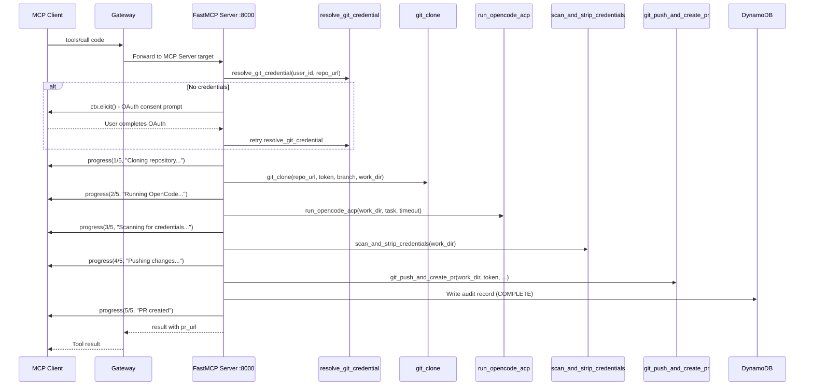
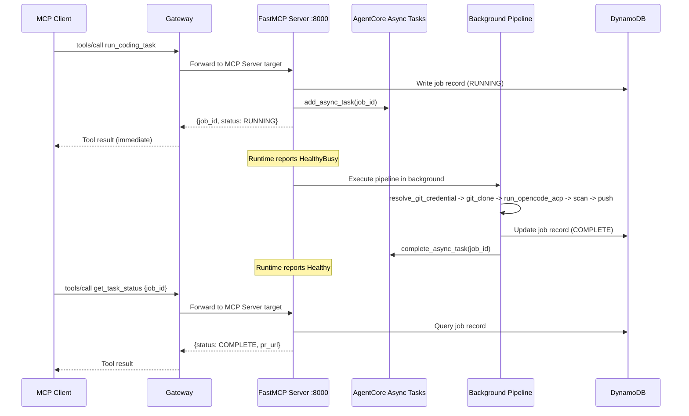
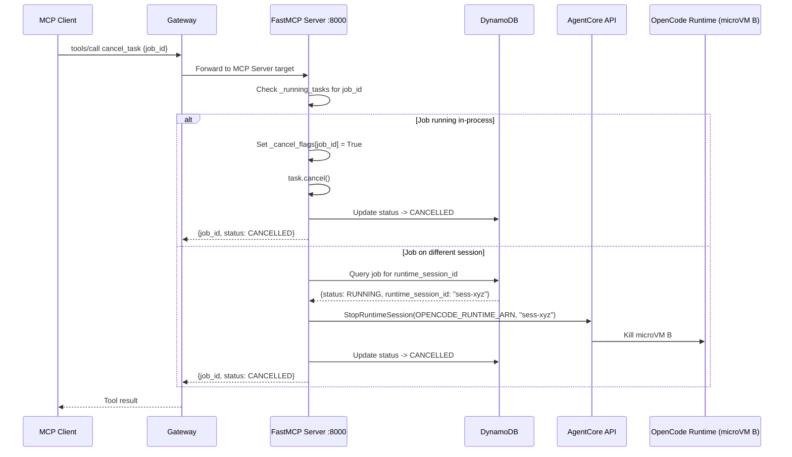
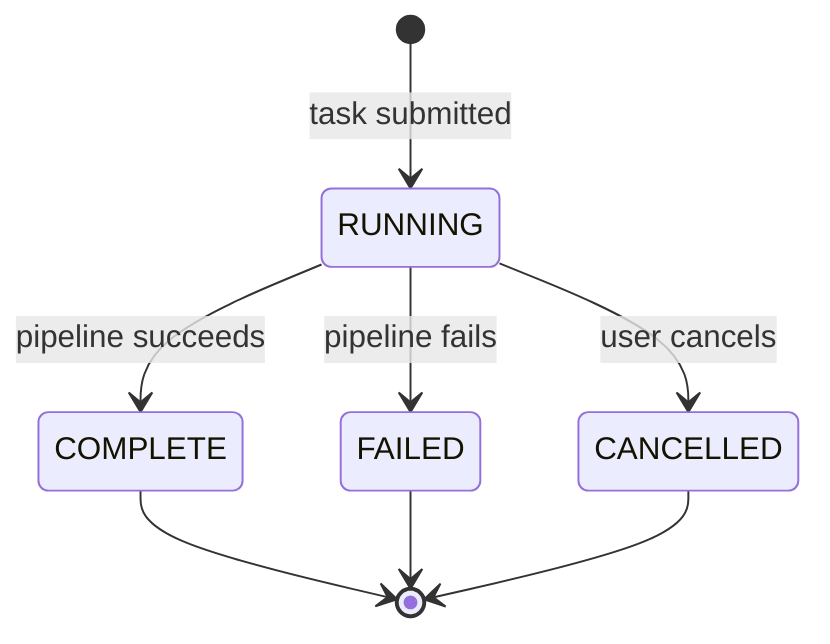
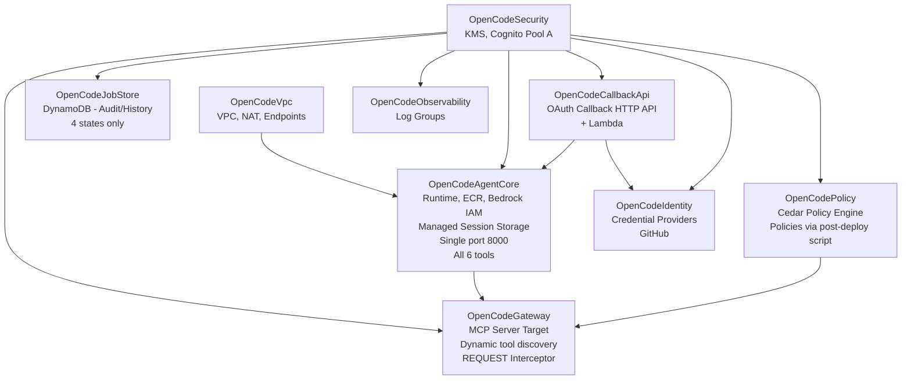

<!-- Copyright Amazon.com, Inc. or its affiliates. All Rights Reserved. -->
<!-- SPDX-License-Identifier: MIT-0 -->

# Architecture

> *Architecture of the sample deployment. Defaults optimize for cost and clarity, not production resilience. See [HARDENING.md](HARDENING.md) for production considerations.*

This document is the architecture deep dive for the sample. It expands on the high-level Mermaid graph in the top-level [README](../README.md#architecture) with a component-by-component walkthrough, three message-flow sequence diagrams (sync, async, cancellation), the DynamoDB job-lifecycle state diagram, and the CDK stack layout.

## Architecture Walkthrough

A request starts at your MCP client and flows through every component in the top-level architecture graph. This section walks through each component and why it's there. Service names are introduced at first mention: Amazon Bedrock AgentCore (AgentCore), Amazon Virtual Private Cloud (Amazon VPC), Amazon Bedrock, and AWS Key Management Service (AWS KMS); subsequent mentions use the short form.

### MCP Client -> AgentCore Gateway

Your MCP client (Kiro, Claude Desktop, Cursor) sends a `tools/call` request to the AgentCore Gateway. The Gateway is a managed MCP endpoint - it handles authentication, authorization, and routing so the container doesn't have to. Inbound requests authenticate via Cognito JWT tokens - the Gateway validates the JWT signature, expiry, and audience before invoking the interceptor, so the interceptor trusts the token and skips verification. A lightweight REQUEST interceptor Lambda extracts the `user_id` from the JWT claims and injects it into the tool arguments, so every downstream component knows who's calling without parsing tokens itself. The interceptor strips the inbound `Authorization` header so it doesn't override the Gateway's outbound SigV4 signature - this is critical for `GATEWAY_IAM_ROLE` to work correctly.

> **Interceptor header stripping is critical.** The REQUEST interceptor Lambda strips the inbound `Authorization` header (Cognito JWT) before returning `transformedGatewayRequest.headers`. Per [AWS docs on interceptor header propagation](https://docs.aws.amazon.com/bedrock-agentcore/latest/devguide/gateway-headers.html#gateway-headers-interceptor-propagation), any headers returned by the interceptor are forwarded to the target. If the inbound Cognito JWT were forwarded, it would override the Gateway's outbound SigV4 `Authorization` header, causing a signature mismatch at the Runtime. The interceptor's `forwarded_headers = {k: v for k, v in headers.items() if k.lower() != "authorization"}` prevents this.

### Cedar Policy Engine

Before the request reaches the Runtime, the Gateway evaluates Cedar policies. These are declarative rules that control who can run which tools against which repos. A readonly role can call `get_task_status` and `list_tasks` but not `run_coding_task`. A global pattern can block all `*-production` repos for every role. The git provider enforces repo-level access separately via the user's OAuth token - Cedar handles the platform-level controls.

### OpenCode Runtime Container (FastMCP Server, port 8000)

The Gateway forwards the request to a single FastMCP server running inside a Firecracker microVM. Python was chosen because the entire stack - CDK, lambdas, tests - is Python. One language, one set of patterns, and compatibility with `agentcore deploy`. FastMCP provides Streamable HTTP transport, `ctx.elicit()` for interactive prompts, and `ctx.report_progress()` for streaming - all used by the sync and async paths.

One process, one port, one codebase handles all 6 tools. The server exposes two coding execution modes plus four control tools:

**Sync (`code` tool)** - stays connected, streams progress at each pipeline phase (clone 1/5, OpenCode running 2/5, credential scan 3/5, push 4/5, done 5/5), and returns the PR URL when finished. If git credentials are missing, `ctx.elicit()` presents the OAuth URL inline - the user authorizes in their browser and the pipeline resumes automatically.

**Async (`run_coding_task` tool)** - writes a RUNNING record to DynamoDB, calls `app.add_async_task(job_id)` to register with AgentCore, and returns `{job_id, status: "RUNNING"}` immediately. The pipeline then runs as a background `asyncio.Task` inside the same microVM. No queue, no separate worker - the microVM isolation means each session is already sandboxed. The Runtime signals `HealthyBusy` while background tasks are active, so AgentCore won't route new sessions to an overloaded VM. Async tasks run fully autonomously - no mid-task clarification. OAuth must be resolved before submission (use `connect_git_host` first).

The MCP server entry point is [`container/code_mcp_server.py`](../container/code_mcp_server.py).

### The Pipeline (Shared Tool Implementations)

Both sync and async paths execute the same five-step pipeline, implemented as composable tool functions under [`container/tools/`](../container/tools/):

1. **[resolve_git_credential](../container/tools/resolve_git_credential.py)** - calls AgentCore Identity SDK to get the user's OAuth token for the git host. If the token doesn't exist yet, the sync path uses `ctx.elicit()` to prompt OAuth consent; the async path fails immediately with `git_host_not_connected`.
2. **[git_clone](../container/tools/git_clone.py)** - shallow clone (`--depth 1`) with optional sparse checkout. Uses the OAuth token for authentication.
3. **[run_opencode_acp](../container/tools/run_opencode_acp.py)** - spawns the OpenCode binary as a subprocess communicating via ACP protocol over stdin/stdout. Configurable timeout with SIGTERM -> SIGKILL escalation (5-second grace period).
4. **[scan_and_strip_credentials](../container/tools/scan_and_strip_credentials.py)** - regex scanner that checks modified files for AWS access keys, `sk-` API keys, PEM private keys, and high-entropy secret assignments. Replaces matches with `<REDACTED_SECRET>` before push.
5. **[git_push_and_create_pr](../container/tools/git_push_and_create_pr.py)** - commits, pushes with 3-retry rebase logic (fetch + rebase between retries to handle concurrent pushes), and creates a GitHub PR via the API.

Failed tasks fail immediately - there are no task-level retries or dead-letter queues. The git push retries above are the only retry logic in the system, handling a specific recoverable failure (concurrent pushes to the same branch).

### DynamoDB (Job History + Audit)

DynamoDB stores lightweight audit records - not a state machine. Four states: RUNNING, COMPLETE, FAILED, CANCELLED. Records are partitioned by user (`PK = user#{user_id}`) so queries are naturally scoped. The `get_task_status` and `list_tasks` tools read from here; the pipeline writes on completion or failure. Each record includes the `runtime_session_id` for cross-session cancellation. See [`container/lib/dynamodb_helpers.py`](../container/lib/dynamodb_helpers.py).

### Managed Session Storage

AgentCore managed session storage provides filesystem persistence across microVM stop/resume. Git clones and partial work survive without custom S3 sync logic. The pipeline places work directories under the managed session path so if a microVM dies mid-task, a resumed session on a new VM picks up where it left off.

### Cancellation

Since all 6 tools run in the same process, `cancel_task` first attempts in-process cancellation: it checks the `_running_tasks` dict for the target `job_id`, sets the cancel flag, and calls `task.cancel()` on the asyncio task. If the job isn't running in-process (e.g., it's on a different session), `cancel_task` falls back to cross-session cancellation - it queries the job record from DynamoDB to get the `runtime_session_id`, then calls `StopRuntimeSession` to terminate the remote microVM. The DynamoDB record is updated to CANCELLED regardless of which cancellation path succeeds.

### Observability

OTEL metrics flow to the ADOT collector sidecar (managed by AgentCore) for CloudWatch GenAI observability dashboards. Every task is traceable per user - duration and files edited are recorded per job. Cost alarms and custom dashboards are not deployed by this stack; AgentCore's built-in GenAI observability provides token usage and cost visibility out of the box. See [`container/lib/metrics.py`](../container/lib/metrics.py).

## Message Flow Reference

### Sync Path (`code` tool)

### Async Path (`run_coding_task` tool)

### Cancellation (`cancel_task` tool)

## Job Lifecycle

DynamoDB is used for lightweight audit/history records only - not a state machine. Four states, all terminal except RUNNING:

## CDK Stack Structure

Nine CDK stacks in [`stacks/`](../stacks/):

| Stack | File | Purpose |
|-------|------|---------|
| `OpenCodeVpc` | [`stacks/vpc_stack.py`](../stacks/vpc_stack.py) | VPC, NAT, ECR endpoints |
| `OpenCodeSecurity` | [`stacks/security_stack.py`](../stacks/security_stack.py) | KMS, Cognito User Pool (Pool A - end-user auth) |
| `OpenCodeJobStore` | [`stacks/job_store_stack.py`](../stacks/job_store_stack.py) | DynamoDB job history/audit (user-partitioned, 4 states) |
| `OpenCodeCallbackApi` | [`stacks/callback_api_stack.py`](../stacks/callback_api_stack.py) | OAuth Callback HTTP API + Lambda ([`lambda/oauth_callback/index.py`](../lambda/oauth_callback/index.py)) |
| `OpenCodeAgentCore` | [`stacks/agentcore_stack.py`](../stacks/agentcore_stack.py) | Runtime, ECR, Bedrock IAM role, managed session storage, all 6 MCP tools |
| `OpenCodeGateway` | [`stacks/gateway_stack.py`](../stacks/gateway_stack.py) | Managed Gateway with MCP Server target + REQUEST interceptor ([`lambda/interceptor/index.py`](../lambda/interceptor/index.py)) |
| `OpenCodePolicy` | [`stacks/policy_stack.py`](../stacks/policy_stack.py) | Cedar Policy Engine (policies created post-deploy via `scripts/create-policies.py`) |
| `OpenCodeIdentity` | [`stacks/identity_stack.py`](../stacks/identity_stack.py) | Credential Provider (GitHub) |
| `OpenCodeObservability` | [`stacks/observability_stack.py`](../stacks/observability_stack.py) | CloudWatch log groups (GenAI dashboard + ADOT provided by AgentCore platform) |

## Architectural Decisions

### Gateway -> Runtime Authentication: GATEWAY_IAM_ROLE with SigV4

**Problem:** The Gateway needs to authenticate to Runtimes when routing tool calls.

**Solution:** `GATEWAY_IAM_ROLE` - the Gateway signs outbound requests with SigV4 using its IAM role (`service: bedrock-agentcore`), and the Runtime validates them via standard IAM SigV4 auth (the default - no authorizer configuration needed). This is the standard AWS service-to-service auth pattern: simpler, no extra Cognito pool, no token management.

**Critical dependency:** The REQUEST interceptor Lambda must strip the inbound `Authorization` header before returning `transformedGatewayRequest.headers`. Per [AWS docs on interceptor header propagation](https://docs.aws.amazon.com/bedrock-agentcore/latest/devguide/gateway-headers.html#gateway-headers-interceptor-propagation), headers returned by the interceptor are forwarded to the target. If the inbound Cognito JWT were forwarded, it would override the Gateway's outbound SigV4 `Authorization` header, causing a signature mismatch at the Runtime.

### Dynamic Tool Discovery via Implicit Sync

**Problem:** The Gateway needs to know which tools each Runtime exposes.

**Solution:** Dynamic tool discovery via implicit sync during `CreateGatewayTarget`. When a target is created without `mcpToolSchema`, the Gateway calls `tools/list` on the Runtime automatically. Runtimes respond in ~1 second, well within the discovery timeout. Tool definitions stay in sync with the server code - no duplicated JSON to maintain.
