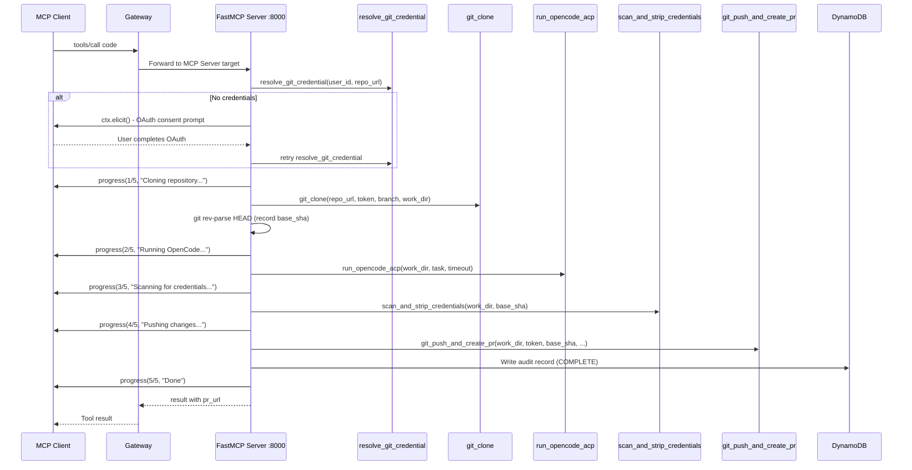
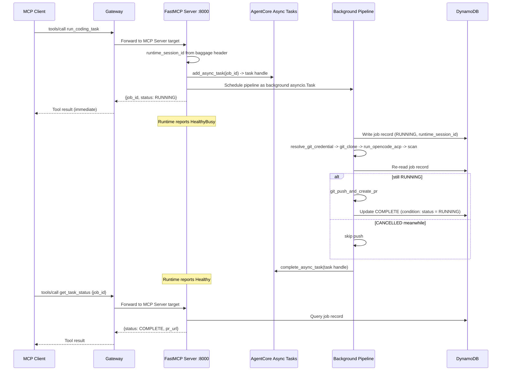
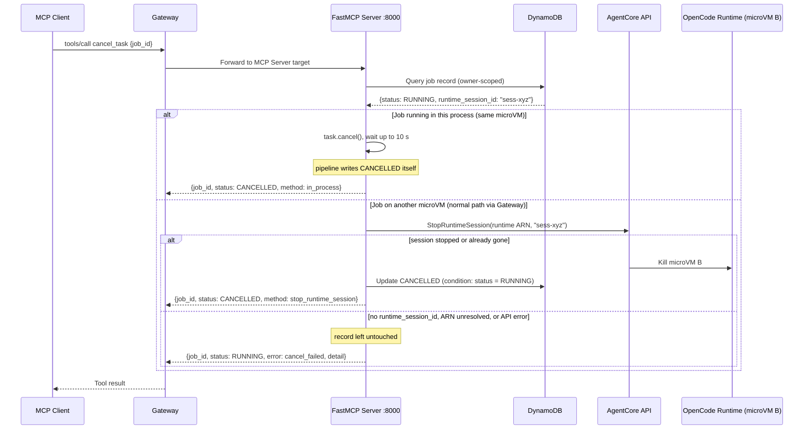
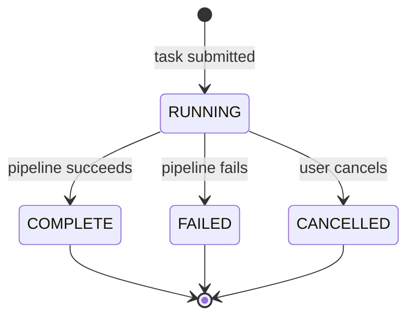
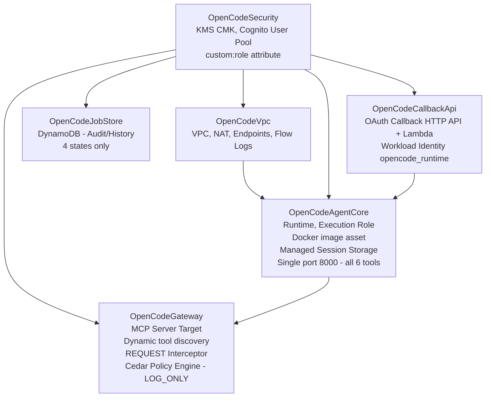

<!-- Copyright Amazon.com, Inc. or its affiliates. All Rights Reserved. -->
<!-- SPDX-License-Identifier: MIT-0 -->

# Architecture

> *Architecture of the sample deployment. Defaults optimize for cost and clarity, not production resilience. See [HARDENING.md](HARDENING.md) for production considerations.*

This document is the architecture deep dive for the sample. It expands on the high-level Mermaid graph in the top-level [README](../README.md#architecture) with a component-by-component walkthrough, three message-flow sequence diagrams (sync, async, cancellation), the DynamoDB job-lifecycle state diagram, and the CDK stack layout.

## Architecture Walkthrough

A request starts at your MCP client and flows through every component in the top-level architecture graph. This section walks through each component and why it's there. Service names are introduced at first mention: Amazon Bedrock AgentCore (AgentCore), Amazon Virtual Private Cloud (Amazon VPC), Amazon Bedrock, and AWS Key Management Service (AWS KMS); subsequent mentions use the short form.

### MCP Client -> AgentCore Gateway

Your MCP client (Kiro, Claude Desktop, Cursor) sends a `tools/call` request to the AgentCore Gateway. The Gateway is a managed MCP endpoint - it handles authentication, authorization, and routing so the container doesn't have to. Inbound requests authenticate via Cognito JWT tokens - the Gateway validates the JWT signature, expiry, and audience before invoking the interceptor, so the interceptor trusts the token and skips verification. A lightweight REQUEST interceptor Lambda extracts the `user_id` from the JWT `sub` claim (no other claim is used) and injects it into the tool arguments, so every downstream component knows who's calling without parsing tokens itself. Any client-supplied `_user_id` is discarded, and a `tools/call` without a derivable identity is rejected. The interceptor strips the inbound `Authorization` header so it doesn't override the Gateway's outbound SigV4 signature - this is critical for `GATEWAY_IAM_ROLE` to work correctly.

> **Interceptor header stripping is critical.** The REQUEST interceptor Lambda strips the inbound `Authorization` header (Cognito JWT) before returning `transformedGatewayRequest.headers`. Per [AWS docs on interceptor header propagation](https://docs.aws.amazon.com/bedrock-agentcore/latest/devguide/gateway-headers.html#gateway-headers-interceptor-propagation), any headers returned by the interceptor are forwarded to the target. If the inbound Cognito JWT were forwarded, it would override the Gateway's outbound SigV4 `Authorization` header, causing a signature mismatch at the Runtime. The interceptor's `forwarded_headers = {k: v for k, v in headers.items() if k.lower() != "authorization"}` prevents this.

### Cedar Policy Engine

Before the request reaches the Runtime, the Gateway evaluates Cedar policies. These are declarative rules that control who can run which tools against which repos. Permits are role-gated: `admin` and `developer` can call the six tools, and `readonly` can call only `get_task_status` and `list_tasks` (it is also explicitly forbidden from `code`, `run_coding_task`, and `cancel_task`). Under ENFORCE, a caller with no recognised role is denied every tool. A global forbid blocks `code` and `run_coding_task` for every role when `repo_url` ends in `-production`, `-production.git`, or `-production/` (a case-sensitive guardrail, not an access boundary). Policies run in LOG_ONLY mode by default. The git provider enforces repo-level access separately via the user's OAuth token - Cedar handles the platform-level controls.

### OpenCode Runtime Container (FastMCP Server, port 8000)

The Gateway forwards the request to a single FastMCP server running inside a Firecracker microVM. Python was chosen because the entire stack - CDK, lambdas, tests - is Python. One language, one set of patterns, and compatibility with `agentcore deploy`. FastMCP provides Streamable HTTP transport, `ctx.elicit()` for interactive prompts, and `ctx.report_progress()` for progress notifications - the sync path uses all three, the async path only the transport.

One process, one port, one codebase handles all 6 tools. The server exposes two coding execution modes plus four control tools:

**Sync (`code` tool)** - stays connected, reports progress at each pipeline phase (clone 1/5, OpenCode running 2/5, credential scan 3/5, push 4/5, done 5/5), and returns the PR URL when finished. The progress events reach the client as `notifications/progress` SSE chunks because the Gateway has response streaming enabled (`EnableResponseStreaming` in [`stacks/gateway_stack.py`](../stacks/gateway_stack.py)); the client must send `Accept: application/json, text/event-stream` and a `_meta.progressToken`, otherwise FastMCP emits nothing and the Gateway returns a single JSON body. If git credentials are missing, `ctx.elicit()` presents the OAuth URL inline - the user authorizes in their browser and the pipeline resumes automatically.

**Async (`run_coding_task` tool)** - captures the Runtime session id from the inbound `baggage` header (`session.id`), calls `app.add_async_task(job_id)` to register with AgentCore, schedules the pipeline as a background `asyncio.Task`, and returns `{job_id, status: "RUNNING"}` immediately. The pipeline's first step is to write the RUNNING record (with `runtime_session_id`) to DynamoDB, so a `get_task_status` call that races the submission by a few milliseconds can still see `Job not found`. `add_async_task` returns an integer task handle; the background task's `finally` block passes that same handle to `app.complete_async_task(handle)` so the Runtime goes back to `Healthy` (completing with the wrong id is rejected by the SDK with an `Attempted to complete unknown task ID` warning log and would leave the microVM `HealthyBusy` for good). The pipeline runs inside the same microVM. No queue, no separate worker - the microVM isolation means each session is already sandboxed. The Runtime signals `HealthyBusy` while background tasks are active, so AgentCore won't route new sessions to an overloaded VM. Async tasks run fully autonomously - no mid-task clarification. OAuth must be resolved before submission (use `connect_git_host` first).

The MCP server entry point is [`container/code_mcp_server.py`](../container/code_mcp_server.py).

### The Pipeline (Shared Tool Implementations)

Both sync and async paths execute the same five-step pipeline, implemented as composable tool functions under [`container/tools/`](../container/tools/). The pipeline accepts only `https://` repo URLs, rejects `target_branch == base_branch`, and records `base_sha` (`git rev-parse HEAD`) after checkout and before OpenCode runs.

1. **[resolve_git_credential](../container/tools/resolve_git_credential.py)** - calls AgentCore Identity SDK to get the user's OAuth token for the git host. If the token doesn't exist yet, the sync path uses `ctx.elicit()` to prompt OAuth consent; the async path fails immediately with `git_host_not_connected`.
2. **[git_clone](../container/tools/git_clone.py)** - shallow clone (`--depth 1`) of the base branch over HTTPS only (`GIT_ALLOW_PROTOCOL=https`). The OAuth token is supplied through a short-lived `GIT_ASKPASS` script, never in the URL. After the clone the pipeline sets the commit identity, creates `target_branch`, records `base_sha`, and snapshots `.git/config`.
3. **[run_opencode_acp](../container/tools/run_opencode_acp.py)** - spawns the pinned OpenCode binary (release 1.18.34, SHA-256 verified at image build) in its own session and process group, communicating via ACP protocol over stdin/stdout. Config is passed inline via `OPENCODE_CONFIG_CONTENT`; no `opencode.json` is written into the repo. Whether the inline config overrides a repository's own config on OpenCode 1.18.34 is to be verified at deploy. Agent permission requests are rejected (the config already allows `edit` and `bash`). OpenCode stderr is logged at INFO. On timeout, or after a normal exit, the whole process group gets SIGTERM, then SIGKILL after a 5-second grace period, then one more group SIGKILL so background children do not outlive the run. A descendant that starts its own session (`setsid`) escapes the group; that is an accepted residual risk because every process in the microVM already runs with the execution role. The pipeline then restores `.git/config` from the post-clone snapshot.
4. **[scan_and_strip_credentials](../container/tools/scan_and_strip_credentials.py)** - regex scanner over files changed in agent self-commits (`base_sha..HEAD`), staged and unstaged edits, and untracked files. Patterns: AWS access keys (`AKIA`/`ASIA`), `sk-` API keys, GitHub tokens (`gh[pousr]_`, `github_pat_`), `glpat-` tokens, PEM private keys, and high-entropy `secret`/`password`/`token`/`key` assignments. Replaces matches with `<REDACTED_SECRET>` before push. A file-discovery failure fails the job.
5. **[git_push_and_create_pr](../container/tools/git_push_and_create_pr.py)** - squashes everything since `base_sha` into one commit built from the scanned tree (`git reset --soft base_sha`, then `add -A` and a single commit), pushes with 3-retry rebase logic (fetch + rebase between retries to handle concurrent pushes), and creates a GitHub PR via the API. Push and PR are skipped when there is no net change since `base_sha`. The push URL is derived from the validated `repo_url`, not from the `origin` remote; git runs with hooks, fsmonitor, and credential helpers disabled, global/system config ignored, and `GIT_ALLOW_PROTOCOL=https`; the token is supplied via `GIT_ASKPASS`.

The `.git/config` restore, the hardened git environment, and the process-group kill together protect the integrity of the push and PR: the branch that lands on the validated `repo_url` is exactly the tree the scanner inspected, and no repository hook or credential helper runs during the push. They are not a credential boundary. OpenCode runs with the Runtime execution role (see [THREAT-MODEL.md](THREAT-MODEL.md), OC-E), and the helpers live in [`container/lib/git_safety.py`](../container/lib/git_safety.py).

Failed tasks fail immediately - there are no task-level retries or dead-letter queues. The git push retries above are the only retry logic in the system, handling a specific recoverable failure (concurrent pushes to the same branch).

### DynamoDB (Job History + Audit)

DynamoDB stores lightweight audit records - not a state machine. Four states: RUNNING, COMPLETE, FAILED, CANCELLED. Records are partitioned by user (`PK = user#{user_id}`, `SK = job#{job_id}#{created_at}`) so queries are naturally scoped; there is no secondary index. The `get_task_status` and `list_tasks` tools read from here; the pipeline writes the RUNNING row at start and the terminal row on completion, failure, or cancellation. Each record includes the `runtime_session_id` for cross-session cancellation (captured from the inbound `baggage` header); it is internal and is not returned by the tools, which share one 13-field public record shape (`serialize_job_record`). All terminal writes carry a `ConditionExpression` on `status = RUNNING`, so the first terminal state wins. See [`container/lib/dynamodb_helpers.py`](../container/lib/dynamodb_helpers.py).

### Managed Session Storage

AgentCore managed session storage (Preview) provides filesystem persistence across microVM stop/resume. The Runtime mounts it at `/mnt/session` in `us-east-1` by default (override with `enable_filesystem_configurations`). The pipeline creates work directories under `SESSION_STORAGE_PATH`, which defaults to `/tmp/opencode-sessions` and is not set by the stack, so clones are not on the mount today; pointing it at `/mnt/session` is a deferred follow-up. Even with files on the mount, an interrupted job is not resumed automatically.

### Cancellation

`cancel_task` reads the job record from DynamoDB (owner-scoped) and stops the job where it actually runs. If the `job_id` is in this process's `_running_tasks` dict, the asyncio task is cancelled directly and the tool waits up to `IN_PROCESS_CANCEL_TIMEOUT_S` (default 10 s) for it to unwind. Through the Gateway that almost never happens: every `tools/call` lands on a fresh Runtime session, so the normal path is cross-session - the tool takes `runtime_session_id` from the record and calls the control-plane `StopRuntimeSession` API (the Runtime ARN comes from `RUNTIME_ARN`, or is discovered by `RUNTIME_NAME` via `ListAgentRuntimes`), which kills the worker microVM. Only when something was stopped, or `StopRuntimeSession` reports the session as already gone, does the tool write `CANCELLED`; the write is conditional on the record still being `RUNNING` (`ConditionExpression`), and the pipeline uses the same condition for its own COMPLETE/FAILED writes and re-reads the record before the push step, so a worker that dies mid-push cannot flip a cancelled job back to COMPLETE. If nothing could be stopped (no `runtime_session_id` on the record, ARN unresolved, API error) the tool returns `cancel_failed` with a `detail` and leaves the record untouched. The full response contract is in [TOOLS.md](TOOLS.md#cancel_task---stop-a-running-job).

### Observability

OTEL metrics flow to the ADOT collector sidecar (managed by AgentCore) for CloudWatch GenAI observability dashboards. Every job record is attributable per user via DynamoDB - duration and files edited are recorded per job. There is no observability stack: the ADOT collector and the GenAI dashboard are platform-provided, and the CDK tree only creates CloudWatch log groups for the Lambdas it owns (interceptor, OAuth callback, authorizer) plus VPC flow logs. Cost alarms and custom dashboards are not deployed; AgentCore's built-in GenAI observability provides token usage and cost visibility out of the box. See [`container/lib/metrics.py`](../container/lib/metrics.py).

## Message Flow Reference

### Sync Path (`code` tool)

```mermaid
sequenceDiagram
    participant MC as MCP Client
    participant GW as Gateway
    participant MCP as FastMCP Server :8000
    participant CRED as resolve_git_credential
    participant CLONE as git_clone
    participant OC as run_opencode_acp
    participant SCAN as scan_and_strip_credentials
    participant PUSH as git_push_and_create_pr
    participant DDB as DynamoDB

    MC->>GW: tools/call code
    GW->>MCP: Forward to MCP Server target

    MCP->>CRED: resolve_git_credential(user_id, repo_url)
    alt No credentials
        MCP->>MC: ctx.elicit() - OAuth consent prompt
        MC-->>MCP: User completes OAuth
        MCP->>CRED: retry resolve_git_credential
    end

    MCP->>MC: progress(1/5, "Cloning repository...")
    MCP->>CLONE: git_clone(repo_url, token, branch, work_dir)
    MCP->>MCP: git rev-parse HEAD (record base_sha)

    MCP->>MC: progress(2/5, "Running OpenCode...")
    MCP->>OC: run_opencode_acp(work_dir, task, timeout)

    MCP->>MC: progress(3/5, "Scanning for credentials...")
    MCP->>SCAN: scan_and_strip_credentials(work_dir, base_sha)

    MCP->>MC: progress(4/5, "Pushing changes...")
    MCP->>PUSH: git_push_and_create_pr(work_dir, token, base_sha, ...)

    MCP->>DDB: Write audit record (COMPLETE)
    MCP->>MC: progress(5/5, "Done")
    MCP-->>GW: result with pr_url
    GW-->>MC: Tool result
```

### Async Path (`run_coding_task` tool)

```mermaid
sequenceDiagram
    participant MC as MCP Client
    participant GW as Gateway
    participant MCP as FastMCP Server :8000
    participant AC as AgentCore Async Tasks
    participant PIPE as Background Pipeline
    participant DDB as DynamoDB

    MC->>GW: tools/call run_coding_task
    GW->>MCP: Forward to MCP Server target

    MCP->>MCP: runtime_session_id from baggage header
    MCP->>AC: add_async_task(job_id) -> task handle
    MCP->>PIPE: Schedule pipeline as background asyncio.Task
    MCP-->>GW: {job_id, status: RUNNING}
    GW-->>MC: Tool result (immediate)

    Note over MCP: Runtime reports HealthyBusy

    PIPE->>DDB: Write job record (RUNNING, runtime_session_id)
    PIPE->>PIPE: resolve_git_credential -> git_clone -> run_opencode_acp -> scan
    PIPE->>DDB: Re-read job record
    alt still RUNNING
        PIPE->>PIPE: git_push_and_create_pr
        PIPE->>DDB: Update COMPLETE (condition: status = RUNNING)
    else CANCELLED meanwhile
        PIPE->>PIPE: skip push
    end
    PIPE->>AC: complete_async_task(task handle)

    Note over MCP: Runtime reports Healthy

    MC->>GW: tools/call get_task_status {job_id}
    GW->>MCP: Forward to MCP Server target
    MCP->>DDB: Query job record
    MCP-->>GW: {status: COMPLETE, pr_url}
    GW-->>MC: Tool result
```

### Cancellation (`cancel_task` tool)

```mermaid
sequenceDiagram
    participant MC as MCP Client
    participant GW as Gateway
    participant MCP as FastMCP Server :8000
    participant DDB as DynamoDB
    participant AC as AgentCore API
    participant MCP_B as OpenCode Runtime (microVM B)

    MC->>GW: tools/call cancel_task {job_id}
    GW->>MCP: Forward to MCP Server target

    MCP->>DDB: Query job record (owner-scoped)
    DDB-->>MCP: {status: RUNNING, runtime_session_id: "sess-xyz"}

    alt Job running in this process (same microVM)
        MCP->>MCP: task.cancel(), wait up to 10 s
        Note over MCP: pipeline writes CANCELLED itself
        MCP-->>GW: {job_id, status: CANCELLED, method: in_process}
    else Job on another microVM (normal path via Gateway)
        MCP->>AC: StopRuntimeSession(runtime ARN, "sess-xyz")
        alt session stopped or already gone
            AC->>MCP_B: Kill microVM B
            MCP->>DDB: Update CANCELLED (condition: status = RUNNING)
            MCP-->>GW: {job_id, status: CANCELLED, method: stop_runtime_session}
        else no runtime_session_id, ARN unresolved, or API error
            Note over MCP: record left untouched
            MCP-->>GW: {job_id, status: RUNNING, error: cancel_failed, detail}
        end
    end

    GW-->>MC: Tool result
```

## Job Lifecycle

DynamoDB is used for lightweight audit/history records only - not a state machine. Four states, all terminal except RUNNING:

```mermaid
stateDiagram-v2
    [*] --> RUNNING : task submitted
    RUNNING --> COMPLETE : pipeline succeeds
    RUNNING --> FAILED : pipeline fails
    RUNNING --> CANCELLED : user cancels
    COMPLETE --> [*]
    FAILED --> [*]
    CANCELLED --> [*]
```

## CDK Stack Structure

Six CDK stacks in [`stacks/`](../stacks/), wired in [`app.py`](../app.py):

```mermaid
graph TD
    SEC[OpenCodeSecurity<br/>KMS CMK, Cognito User Pool<br/>custom:role attribute]
    VPC[OpenCodeVpc<br/>VPC, NAT, Endpoints, Flow Logs]
    JS[OpenCodeJobStore<br/>DynamoDB - Audit/History<br/>4 states only]
    CB[OpenCodeCallbackApi<br/>OAuth Callback HTTP API + Lambda<br/>Workload Identity opencode_runtime]
    AC[OpenCodeAgentCore<br/>Runtime, Execution Role<br/>Docker image asset<br/>Managed Session Storage<br/>Single port 8000 - all 6 tools]
    GW[OpenCodeGateway<br/>MCP Server Target<br/>Dynamic tool discovery<br/>REQUEST Interceptor<br/>Cedar Policy Engine - LOG_ONLY]

    SEC --> VPC
    SEC --> JS
    SEC --> CB
    VPC --> AC
    SEC --> AC
    CB --> AC
    SEC --> GW
    AC --> GW
```

| Stack | File | Purpose |
|-------|------|---------|
| `OpenCodeSecurity` | [`stacks/security_stack.py`](../stacks/security_stack.py) | KMS CMK, Cognito User Pool with the `custom:role` attribute (end-user auth), optional CloudTrail |
| `OpenCodeVpc` | [`stacks/vpc_stack.py`](../stacks/vpc_stack.py) | VPC, NAT Gateway, 2 gateway + 9 interface VPC endpoints, flow logs |
| `OpenCodeJobStore` | [`stacks/job_store_stack.py`](../stacks/job_store_stack.py) | DynamoDB job history/audit (user-partitioned, 4 states, no secondary index) |
| `OpenCodeCallbackApi` | [`stacks/callback_api_stack.py`](../stacks/callback_api_stack.py) | OAuth Callback HTTP API + Lambda ([`lambda/oauth_callback/index.py`](../lambda/oauth_callback/index.py)), Lambda authorizer, workload identity `opencode_runtime` |
| `OpenCodeAgentCore` | [`stacks/agentcore_stack.py`](../stacks/agentcore_stack.py) | Runtime and endpoint, execution role (Bedrock, DynamoDB, Identity SDK), Docker image asset, managed session storage, all 6 MCP tools |
| `OpenCodeGateway` | [`stacks/gateway_stack.py`](../stacks/gateway_stack.py) | Managed Gateway with MCP Server target, REQUEST interceptor ([`lambda/interceptor/index.py`](../lambda/interceptor/index.py)), and the Cedar Policy Engine (policies created post-deploy via `scripts/create-policies.py`) |

The GitHub OAuth2 credential provider is not a CDK resource; [`scripts/setup-oauth-app.sh`](../scripts/setup-oauth-app.sh) registers it with AgentCore Identity after deploy.

## Architectural Decisions

### Gateway -> Runtime Authentication: GATEWAY_IAM_ROLE with SigV4

**Problem:** The Gateway needs to authenticate to Runtimes when routing tool calls.

**Solution:** `GATEWAY_IAM_ROLE` - the Gateway signs outbound requests with SigV4 using its IAM role (`service: bedrock-agentcore`), and the Runtime validates them via standard IAM SigV4 auth (the default - no authorizer configuration needed). This is the standard AWS service-to-service auth pattern: simpler, no extra Cognito pool, no token management.

**Critical dependency:** The REQUEST interceptor Lambda must strip the inbound `Authorization` header before returning `transformedGatewayRequest.headers`. Per [AWS docs on interceptor header propagation](https://docs.aws.amazon.com/bedrock-agentcore/latest/devguide/gateway-headers.html#gateway-headers-interceptor-propagation), headers returned by the interceptor are forwarded to the target. If the inbound Cognito JWT were forwarded, it would override the Gateway's outbound SigV4 `Authorization` header, causing a signature mismatch at the Runtime.

### Dynamic Tool Discovery via Implicit Sync

**Problem:** The Gateway needs to know which tools each Runtime exposes.

**Solution:** Dynamic tool discovery via implicit sync during `CreateGatewayTarget`. When a target is created without `mcpToolSchema`, the Gateway calls `tools/list` on the Runtime automatically. Runtimes respond in ~1 second, well within the discovery timeout. Tool definitions stay in sync with the server code - no duplicated JSON to maintain.
